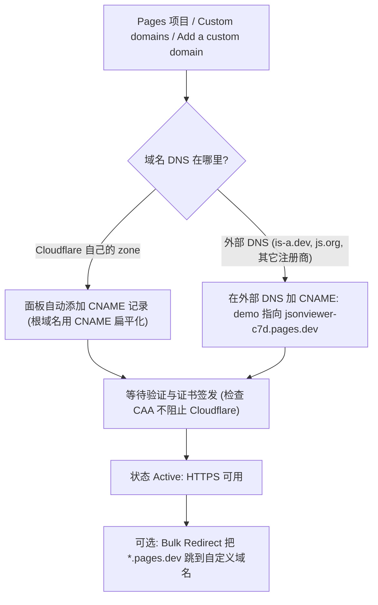
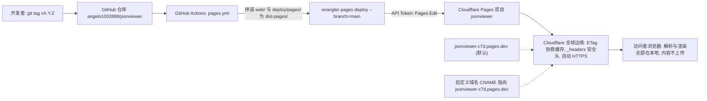
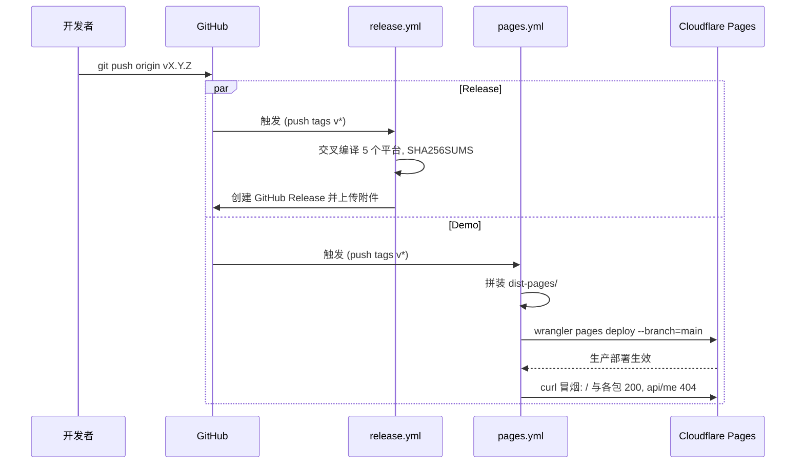
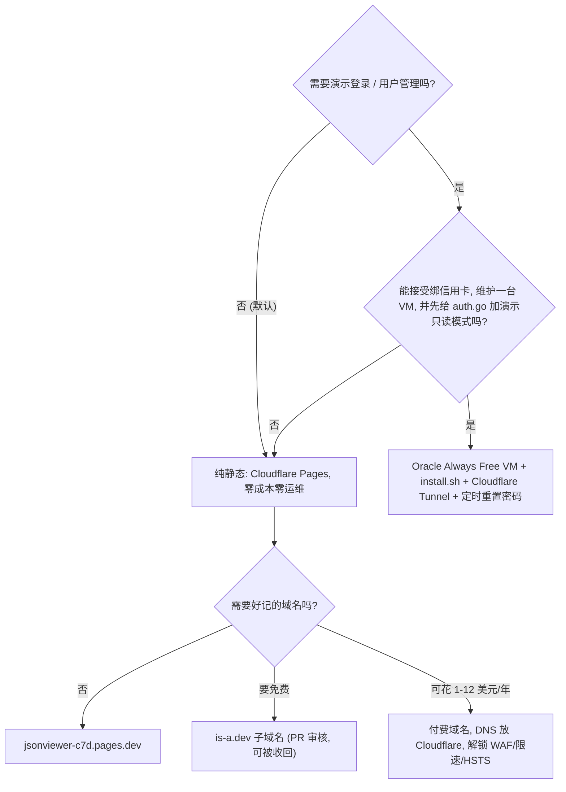
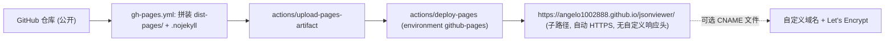

# 公共演示站点部署指南（GitHub + Cloudflare 免费方案）

- 适用版本：jsonviewer v0.3.0
- 核实日期：2026-10-07（平台额度与政策会变，照做前请对照第 13 节来源复核）
- 状态：**方案文档**。本文提到的 `.github/workflows/pages.yml`、`deploy/pages/*` 在写作时仓库中尚不存在，需按第 7 节新增。

> **一句话结论**：纯静态托管即可。推送 `v*` 标签时，由新工作流 `pages.yml` 把 `web/` 与 `deploy/pages/`（`_headers`、`404.html`、`robots.txt`）拼成 `dist-pages/`，用 `cloudflare/wrangler-action@v4` 直传 Cloudflare Pages 生产环境（`<项目名>.pages.dev`），与 Release 并行、零成本。域名先用 `pages.dev`；带登录的演示默认不做。
>
> 阅读指引：只想动手 -> 直接看第 10 节；想知道为何这样选 -> 第 2-4 节；要抄配置 -> 第 6 节。

## 目录

1. [为什么可以纯静态托管](#1-为什么可以纯静态托管)
2. [托管平台对比与推荐](#2-托管平台对比与推荐)
3. [域名方案](#3-域名方案)
4. [总体架构、发布流程与决策树](#4-总体架构发布流程与决策树)
5. [部署方式选择](#5-部署方式选择)
6. [部署流水线与配置文件](#6-部署流水线与配置文件)
7. [最小改动清单](#7-最小改动清单)
8. [带登录的演示为何不推荐](#8-带登录的演示为何不推荐)
9. [运营](#9-运营)
10. [分步操作清单](#10-分步操作清单)
11. [备选：GitHub Pages](#11-备选github-pages)
12. [待确认的决策点](#12-待确认的决策点)
13. [参考来源与未核实项](#13-参考来源与未核实项)

## 1. 为什么可以纯静态托管

已对照本地代码核实的事实：

| 事实 | 说明 |
| --- | --- |
| `web/` 体积很小 | 共 23 个文件、696 KB，最大单文件 `js/vendor/codemirror.bundle.js` 382 KB，远低于任何平台限制 |
| 全部相对路径 | `css/style.css`、`js/...`、`assets/ico/...`；`formats.js` 懒加载 `js/vendor/<name>.bundle.js`，子路径部署也没问题 |
| 没有后端也能工作 | `app.js` 中 `fetch('api/me')` 非 2xx 或网络失败 -> 按未启用登录初始化；只有 401 才跳 `login`（`vendorFailNotice` 同样只在 401 时跳转） |
| 内容不上传 | JSON 只在浏览器内处理，仅写 `sessionStorage` |
| CSP 相关 | 前端没有内联 `<script>`、没有 `style="..."`、没有 `eval`/`new Function`/Web Worker；有 `innerHTML`（自产 HTML）与 `URL.createObjectURL`（下载）。CodeMirror 6 运行时会注入 `<style>`，所以 `style-src` 必须含 `'unsafe-inline'` |
| Go 服务只多了登录和 ETag | `main.go` 对静态文件设 `Cache-Control: no-cache` + 弱 ETag、`X-Content-Type-Options: nosniff`、`Referrer-Policy: same-origin`；静态站上这些由平台和 `_headers` 代替 |
| 平台文件不能放进 `web/` | `main.go` 的 `//go:embed web` 会把 `404.html`、`robots.txt` 打进二进制，所以平台专用文件放 `deploy/pages/`，发布时再拼入 |
| 测试限制 | `tests/e2e.js` 自己 spawn Go 二进制，不能指向远端 URL；部署后只能用 curl 冒烟 |
| 许可证 | 仓库根目录没有 LICENSE 文件；README 写"仅供个人自托管使用" |
| Actions 版本 | 现有 `release.yml` 用 `actions/checkout@v7`、`actions/setup-go@v7`，新工作流保持同版本 |

## 2. 托管平台对比与推荐

方括号数字为第 13 节来源编号。

| 平台 | 免费额度（核实） | 单文件/文件数 | 自定义域名/HTTPS | 默认域名在大陆 | 结论 |
| --- | --- | --- | --- | --- | --- |
| Cloudflare Pages | 500 次构建/月、1 并发、构建 20 分钟超时、100 个项目、每项目 100 个自定义域；文档未列带宽/请求上限（Pages Functions 才计入 Workers 配额）[1] | 20,000 文件，25 MiB/文件[1][8] | 支持外部 DNS 的 CNAME（必须先在面板 "Add a custom domain"）；根域名需把 NS 交给 Cloudflare；证书自动[6] | `*.pages.dev` 走 Cloudflare 任播，能通但慢且不稳（经验性） | **推荐主方案** |
| Cloudflare Workers 静态资源 | 静态资源请求"免费且不限量"[3]；Worker 请求 10 万/天（纯静态不消耗）[4]；Workers Builds 3,000 分钟/月[11] | 20,000 文件，25 MiB[4] | Custom Domain 只能建在自己账户里的 zone 上，不能用别人（is-a.dev/js.org）的 zone[10] | 同上 | 备选一（Cloudflare 官方建议新项目用 Workers[2]） |
| GitHub Pages | 站点 1 GB、带宽 100 GB/月软限制、10 次构建/小时软限制（自定义 Actions 工作流不计）、禁止商业 SaaS/敏感交易[5] | 无单文件限制说明 | 自定义域名 + Let's Encrypt 自动、可 Enforce HTTPS[12]；没有自定义响应头 | `*.github.io` 常被 DNS 污染/间歇性（经验性） | 备选二 |
| Vercel Hobby | 仅限非商业；Fast Data Transfer 100 GB/月、100 次部署/天[13] | CLI 源文件 15,000 个/100 MB | 支持 | `*.vercel.app` 被 DNS 污染（Vercel 官方承认大陆"可能加载缓慢或失败"[14]；腾讯云 2026-04 文章称默认域名被污染[15]） | 不推荐 |
| Netlify Free | 改为按 "credits" 计费，免费 300 credits/月（约 2 美元）[16]，带宽具体数字未核实 | 未核实 | 支持 | 被封/回源 HK、SG（[15]，经验性） | 不推荐 |

Cloudflare Pages 现状：文档没有弃用声明，仍接受新项目，但 Pages 首页提示 "Workers supports most Pages use cases and offers a broader feature set... Start new projects with Workers"[2]。兼容矩阵显示 Rollback、预览 URL、`_headers`、`_redirects`、自定义域名两边都有[9]。

**选 Pages 而不是 Workers 的理由**：

1. 自定义域名可以是外部 DNS 的 CNAME（免费子域名 is-a.dev / js.org 只能走这条路）[6][10]。
2. 直传不需要在仓库里加任何配置文件；Workers 需要 `wrangler.jsonc`。
3. 默认域名 `jsonviewer-c7d.pages.dev` 比 `jsonviewer.<账号子域>.workers.dev` 好记。
4. 以后迁到 Workers 代价很小：加一个 10 行的 `wrangler.jsonc`（`assets.directory: "./dist-pages"`，`not_found_handling: "404-page"`，不需要 `main`[17]），命令改成 `wrangler deploy`，`_headers`/`404.html` 原样可用。

**大陆可访问性（经验性结论，未找到权威测量）**：

- 四家都没有大陆节点。
- Cloudflare 免费计划不走中国网络，`pages.dev` 通常能打开，但首屏可能数秒（一篇个人博客记录约 5 秒[18]）。
- `github.io` 能通但受 DNS 污染影响[19]。
- `vercel.app`、`netlify.app` 基本不可用[14][15]。
- 面向大陆用户的可靠方案只有自托管（现有 `install.sh`）；公共 demo 不以大陆体验为目标。

## 3. 域名方案

| 选项 | 条件/流程 | 限制与风险 | 结论 |
| --- | --- | --- | --- |
| `<项目>.pages.dev` | 创建项目即得，名字全局唯一（`jsonviewer` 是否可用，创建时才知道） | `.dev` 整个 TLD 在 HSTS 预加载表（强制 HTTPS，无副作用） | 默认，第一天就用 |
| is-a.dev | 向 `is-a-dev/register` 提 PR，加 `domains/<name>.json`（CNAME 到 `<项目>.pages.dev`），合并后几分钟生效[20][21] | 仅限个人、非商业开发项目；服务方"可随时以任何理由终止"；禁止用 GitHub 组织账号[22] | 可选的免费记忆名，风险是依赖志愿者项目 |
| js.org | PR 到 `js-org/js.org`，任何支持 CNAME 的主机都行（不限 GitHub Pages）[23] | 要求"直接与 JavaScript 生态相关（npm 包、JS 工具），不收个人页/教程"[23][24]；JSON 查看器属边缘，有被拒风险 | 不作默认 |
| eu.org | 邮件申请，需自备 NS（可交给 Cloudflare）[25] | 审批时间无官方说明，社区反映数周到数月（未核实） | 不推荐 |
| DuckDNS | 面向动态 DNS，只能设 A/AAAA/TXT，不能把 duckdns 子域 CNAME 到 Pages（FAQ 只说可以把自己的域名 CNAME 到 duckdns[26]） | 与 Pages 自定义域名机制不匹配 | 不适用 |
| 付费对照 | Cloudflare Registrar 成本价：.com 约 $10.44、.dev $12.20、.xyz $12.30/续 $11.20[27]（第三方汇总，未查官方价表）；Porkbun .top 首年 $1.63、续费 $4.63[28] | .top/.xyz 声誉差、常被安全产品打低分；买域名后把 DNS 放 Cloudflare 才能用 WAF/限速 | 想要好记名时花 1-12 美元/年最省心 |

**推荐**：先用 `pages.dev`；要好记名就买一个放 Cloudflare 的付费域名（同时解锁 WAF/限速/HSTS 开关）；is-a.dev 作为零成本备选。

自定义域名接入流程：



## 4. 总体架构、发布流程与决策树

总体架构：



打 tag 后两个工作流并行：



决策树：



## 5. 部署方式选择

| 方式 | 做法 | 优点 | 缺点 |
| --- | --- | --- | --- |
| (a) Pages Git 集成 | 构建命令留空（无框架时留空或 `exit 0`）、输出目录 `web`，每次 push main 自动部署[7] | 零工作流 | demo 跟 main 而非 Release；无法拼入 `_headers`/`404.html`（除非污染 `web/`）；选了 Git 集成后同一项目不能改成直传，反之亦然[8] |
| (b) GitHub Actions + wrangler 直传 | 推荐。见第 6 节 | demo 与 Release 同步；可拼平台文件；`workflow_dispatch` 可重部署任意 tag | 需要配置 2 个 secret |

**推荐 (b)**。

## 6. 部署流水线与配置文件

### 6.1 `.github/workflows/pages.yml`

```yaml
name: Demo (Cloudflare Pages)

# 推送 v* 标签即把 web/ 发布到公共演示站（与 Release 并行）；
# 手动触发可重发任意 tag（回滚也可在 Cloudflare 面板 Deployments 里一键完成）。
on:
  push:
    tags: ["v*"]
  workflow_dispatch:
    inputs:
      ref:
        description: "要部署的 tag（留空为当前 ref）"
        required: false
        default: ""

permissions:
  contents: read

concurrency:
  group: demo-pages
  cancel-in-progress: false

env:
  PROJECT: jsonviewer          # Cloudflare Pages 项目名，须先在面板创建（Direct Upload）
  SITE: https://jsonviewer-c7d.pages.dev

jobs:
  deploy:
    runs-on: ubuntu-24.04
    environment:
      name: demo
      url: ${{ env.SITE }}
    steps:
      - uses: actions/checkout@v7
        with:
          ref: ${{ inputs.ref || github.ref }}

      # 发布目录 = web/ + 平台专用文件；不改 web/，避免被 //go:embed 打进二进制
      - name: assemble site
        run: |
          set -e
          rm -rf dist-pages && mkdir dist-pages
          cp -r web/. dist-pages/
          cp deploy/pages/_headers deploy/pages/404.html deploy/pages/robots.txt deploy/pages/favicon.ico dist-pages/
          test -f dist-pages/index.html
          test -f dist-pages/js/vendor/codemirror.bundle.js
          find dist-pages -type f | wc -l

      # 标签 checkout 是 detached HEAD，wrangler 推断不出分支：必须显式 --branch=main
      # （= 项目的 production branch），否则会变成预览部署。
      - name: deploy
        uses: cloudflare/wrangler-action@v4
        with:
          apiToken: ${{ secrets.CLOUDFLARE_API_TOKEN }}
          accountId: ${{ secrets.CLOUDFLARE_ACCOUNT_ID }}
          command: >-
            pages deploy dist-pages
            --project-name=${{ env.PROJECT }}
            --branch=main
            --commit-dirty=true
            --commit-hash=${{ github.sha }}
            --commit-message="${{ inputs.ref || github.ref_name }}"

      # 直传完成即生效；冒烟：页面与各包 200，api/me 必须是 404（不能是 SPA 回退的 200）
      - name: smoke test
        run: |
          set -e
          for i in 1 2 3 4 5 6; do
            curl -fsS -o /dev/null "$SITE/" && break || sleep 10
          done
          for p in / /js/app.js /js/formats.js /css/style.css \
                   /js/vendor/codemirror.bundle.js /js/vendor/yaml.bundle.js /js/vendor/toml.bundle.js; do
            curl -fsS -o /dev/null "$SITE$p"
          done
          code=$(curl -s -o /dev/null -w '%{http_code}' "$SITE/api/me")
          [ "$code" = 404 ] || { echo "api/me 应为 404，实际 $code"; exit 1; }
          curl -sI "$SITE/" | grep -i '^content-security-policy' || echo "（未设置 CSP 头）"   # 仅提示，不判失败
```

可选扩展：再加 `push: branches: [main]` 触发并用 `--branch=preview`，得到 `preview.jsonviewer-c7d.pages.dev` 跟踪 main，生产仍跟 tag（同一文件两种触发，用 `if:` 区分 `--branch`）。

### 6.2 关键注意事项

| 项 | 要点 |
| --- | --- |
| detached HEAD | 标签触发的 checkout 是 detached HEAD，wrangler 从 git 推断不出分支，必须显式 `--branch=main`（等于项目的 production branch）才是生产部署，否则落成预览[8] |
| 项目须先存在 | 在面板创建（Direct Upload），或本地一次性 `npx wrangler pages project create jsonviewer --production-branch=main`[8] |
| `--commit-dirty=true` | `dist-pages/` 未跟踪，wrangler 会认为工作区脏；另传 `--commit-hash`/`--commit-message` 便于面板追溯 |
| Token 最小权限 | 自定义 Token，仅 `Account -> Cloudflare Pages -> Edit`，限定到本账户[8]。Account ID 在面板 Workers & Pages 概览页右侧 |
| Token 排障 | 若报 `Authentication error [code: 10000]`，再加 `User -> User Details -> Read`（历史上 wrangler 解析账户时需要；已传 `accountId` 通常不需要） |
| production branch 核对 | 面板创建后务必核对 Project -> Settings -> Builds & deployments -> Production branch 为 `main`（拖拽上传流程可能不提示），否则 `--branch=main` 会落成预览 |
| Secrets | `CLOUDFLARE_API_TOKEN`、`CLOUDFLARE_ACCOUNT_ID`。`gitHubToken` 可选（在 GitHub Deployments 留记录，需 `deployments: write`），按最小权限默认不加 |
| 两个工作流并行 | `release.yml`、`pages.yml` 同时被 tag 触发，互不依赖 |

### 6.3 `deploy/pages/_headers`

Pages 对每个 200 自动发 `ETag`，默认 `Cache-Control: public, max-age=0, must-revalidate`[9]，正是需要的协商缓存。

```text
/*
  X-Content-Type-Options: nosniff
  X-Frame-Options: DENY
  Referrer-Policy: same-origin
  Permissions-Policy: camera=(), microphone=(), geolocation=()
  Content-Security-Policy-Report-Only: default-src 'self'; script-src 'self'; style-src 'self' 'unsafe-inline'; img-src 'self' data:; connect-src 'self'; object-src 'none'; base-uri 'self'; form-action 'self'; frame-ancestors 'none'

/index.html
  Cache-Control: no-cache

/
  Cache-Control: no-cache
```

- **为什么不加 `immutable`**：vendor 包（`js/vendor/*.bundle.js`）没有内容哈希文件名，加了 `immutable` 后升级时 `app.js` 与旧 bundle 可能错配。
- **CSP 先 Report-Only 后强制**：先用 `Content-Security-Policy-Report-Only`，在预览部署（`--branch=preview`）里打开浏览器控制台，确认 CodeMirror、懒加载包、下载都没有违规，再改成 `Content-Security-Policy`。没有 `report-uri`/`report-to` 时，Report-Only 不会把违规上报到任何地方，只在浏览器控制台可见，验证只能靠人工打开页面。
- 若启用 Cloudflare Web Analytics，需追加 `script-src https://static.cloudflareinsights.com` 与 `connect-src https://cloudflareinsights.com`。
- HSTS：`pages.dev` 已在 `.dev` 预加载范围；自定义域名在 Cloudflare 面板 SSL/TLS -> Edge Certificates 开 HSTS，不放 `_headers`。
- `_headers` 上限 100 条规则、每行 2,000 字符[9]。

### 6.4 `deploy/pages/404.html`

极简、自包含页面：

- 样式写在内联 `<style>`，不引用 `css/style.css`。
- 返回首页链接必须写绝对路径 `href="/"`。Pages 在被请求的路径上原地渲染 404.html，从 `/api/me` 出发的相对链接会解析到 `/api/`。（GitHub Pages 子路径部署需要 `/jsonviewer/`，这也是该备选只写文档不提交的原因之一。）
- 有了顶层 `404.html`，Pages 不再按 SPA 回退，`api/me`、拼错的路径都返回真实 404[9]。没有它时 `api/me` 会 200 返回 index.html，前端靠 `res.json()` 失败的 catch 才走到"未登录"，碰巧能用但不正确。

### 6.5 `deploy/pages/robots.txt`

```
User-agent: *
Allow: /
```

## 7. 最小改动清单

**必须**

| # | 改动 |
| --- | --- |
| 1 | 新增 `deploy/pages/_headers`、`deploy/pages/404.html`、`deploy/pages/robots.txt`（内容见第 6 节） |
| 2 | 新增 `.github/workflows/pages.yml`；`.gitignore` 加 `/dist-pages/` |
| 3 | `web/js/app.js` 关于对话框追加两行通用文案（自托管版同样适用，不按域名判断；`tests/` 没有断言关于对话框文本）：源码链接 `https://github.com/angelo1002888/jsonviewer`；"所有内容只在浏览器内解析，不会上传到任何服务器；托管方（如 Cloudflare）只能看到普通的请求元数据（IP、UA），看不到你的数据" |
| 4 | README.md / README_CN.md 顶部加"在线演示"链接；`docs/DESIGN_CN.md` §6 加一小节"公共演示站"，指向本文 |

**可选**

| # | 改动 |
| --- | --- |
| 5 | `web/index.html` 加 `<meta name="description" content="...">`（SEO/分享卡片），可选 `<link rel="canonical">` |
| 6 | favicon：现有 `assets/ico/object.gif` 够用；可选在 `deploy/pages/` 放 `favicon.ico` 减少 404 噪音（不改 `web/`） |
| 7 | Web Analytics：默认不开（项目定位 "no ads, no analytics"；开了要改 CSP 与隐私文案，并在关于对话框加一句"本站使用 Cloudflare Web Analytics 统计访问量（无 Cookie、不采集个人信息）"）。如开，用 Pages 面板 Metrics -> Enable 一键注入，下次部署生效[30] |
| 8 | LICENSE：公开 demo 本身不需要，但没有许可证会让人无法合法复用；建议补 MIT（由你决定） |
| 9 | GitHub Pages 工作流只写进文档不提交（除非要双部署） |

不需要改 `api/me` 逻辑，Pages 下行为见 6.4。

## 8. 带登录的演示为何不推荐

| 平台 | 现状（核实） | 对本项目的问题 |
| --- | --- | --- |
| Google Cloud Run | 免费额度每计费账号：200 万请求、180,000 vCPU 秒、360,000 GiB 秒/月[31]；需绑卡的计费账号 | 文件系统临时，`users.json` 随实例消失；`*.run.app` 大陆不可达（经验性） |
| Oracle Cloud Always Free | Ampere A1 现为 1,500 OCPU 小时 + 9,000 GB 小时/月（= 2 OCPU/12 GB，较原先 4/24 减半）、2 台 AMD micro、200 GB 存储、10 TB 出流量；7 天内 CPU/网络/内存 95 分位都 <20% 即判闲置可回收[32] | 注册需信用卡且失败率高（经验性）；demo 站必然闲置 -> 被回收，除非升级 PAYG（仍免费但 T&C 不同[33]） |
| Fly.io | 2024-10 起新账号无免费层，按量付费需绑卡[34] | 不可用 |
| Render Free | 750 实例小时/月，15 分钟无流量休眠[35] | 冷启动数十秒；免费层无持久盘，用户数据丢失 |
| Koyeb | 1 个免费 Web 服务（0.1 vCPU/512 MB），需信用卡 $29 预授权；2026-02 被 Mistral 收购，前景不明[36] | 不建议 |

**结论：不值得。** 核心障碍不是额度，而是：

1. `users.json` 需要持久可写目录（DESIGN §6），免费容器平台都是临时文件系统。
2. 公开共享的管理员账号任何人都能改密码把所有人锁在外面（`auth.go` 没有"演示只读"模式）。
3. 登录接口暴露给公网等于邀请暴力尝试。

**如果坚持要做**（第二阶段）：

- 先给 `auth.go` 加一个禁止改密码/禁止用户管理的 `demo = true` 配置项（需要代码改动，由 coder 实现）。
- Oracle Always Free arm64 VM（`install.sh` 支持 aarch64）+ `install.sh`。
- Cloudflare Tunnel 对外（Zero Trust Free 50 用户内免费，无需开放端口[37]）。
- cron 每小时执行 `--reset-password admin`。
- 账号升级到 PAYG，避免闲置回收。

## 9. 运营

| 项 | 说明 |
| --- | --- |
| 成本与滥用 | Pages 免费计划没有超量计费、不绑卡，纯静态带宽/请求无硬上限（文档未列出[1]）；最坏情况是被限流，不会产生账单 |
| WAF/限速 | Free 计划有 5 条 WAF 自定义规则[38]、1 条限速规则（仅 IP 特征、10 秒窗口）[39]；这些是 zone 级功能，只对放在自己 Cloudflare 账户里的域名生效，`pages.dev` 和外部 CNAME 子域名用不上；DDoS 防护对所有流量自动开启 |
| HTTPS | `pages.dev` 自动；自定义域名在面板添加后自动签发（CAA 记录不能禁止 Cloudflare 签发）[6] |
| 更新 | `git tag vX.Y.Z && git push origin vX.Y.Z`，Release 与 demo 并行完成，浏览器靠 ETag 协商拿到新版本 |
| 回滚 | 面板 Deployments -> 任意历史生产部署 -> "Rollback to this deployment"，即时生效，预览部署不能作为回滚目标[40]；或 `workflow_dispatch` 填旧 tag 重发 |
| 预览 | `--branch=<非 main>` 得到 `<branch>.<项目>.pages.dev`，可用于 CSP 验证 |
| 分析 | 默认不开；要看流量用 Pages 面板的请求指标 |
| 监控 | 可用 UptimeRobot 之类外部探测（当前免费额度未核实） |

## 10. 分步操作清单

标 **[手工]** 的必须你自己在网页/本机完成。

| # | 步骤 |
| --- | --- |
| 1 | **[手工]** 注册/登录 Cloudflare 账户（免费，不绑卡） |
| 2 | **[手工]** Workers & Pages -> Create -> Pages -> "Upload assets"（Direct Upload）创建项目，名字 `jsonviewer`（被占则换，并同步改 YAML 的 `PROJECT`/`SITE`）；production branch 填 `main`。首次可随便传一个文件占位，或本地 `npx wrangler login && npx wrangler pages project create jsonviewer --production-branch=main` |
| 3 | **[手工]** My Profile -> API Tokens -> Create Custom Token：权限仅 `Account / Cloudflare Pages / Edit`，Account Resources 限定本账户；复制 Token。概览页复制 Account ID |
| 4 | **[手工]** GitHub 仓库 Settings -> Secrets and variables -> Actions：新增 `CLOUDFLARE_API_TOKEN`、`CLOUDFLARE_ACCOUNT_ID`。可选 Settings -> Environments 建 `demo` 环境并把两个 secret 放进去 |
| 5 | 代码改动（交给 coder）：新增 `deploy/pages/{_headers,404.html,robots.txt}`、`.github/workflows/pages.yml`，改 `app.js` 关于文案与 `index.html` meta；本地 `make build` + e2e/formats 测试仍应通过（`_headers` 不进二进制） |
| 6 | **[手工]** 推送到 main 后用 `workflow_dispatch` 跑一次（或先打一个 `v0.3.1` 之类的 tag）；也可临时改 `--branch=preview` 做一次预览部署验证 CSP |
| 7 | 验证：打开 `https://jsonviewer-c7d.pages.dev/`，粘贴 JSON/YAML/TOML/XML 各一份；DevTools 控制台无 CSP 报告；Network 看 `api/me` 为 404；二次刷新静态资源为 304 |
| 8 | CSP 从 Report-Only 改为强制，再发一次 |
| 9 | **[手工，可选]** 自定义域名：按第 3 节流程图操作；is-a.dev 则提 PR |
| 10 | 文档：README 双语加演示链接，DESIGN §6 指向本文 |

## 11. 备选：GitHub Pages

- 站点 URL：`https://angelo1002888.github.io/jsonviewer/`（子路径；前端相对路径可用）。
- 限制：没有自定义响应头（`_headers` 无效，无法加 CSP 等）；`404.html` 返回链接需要 `/jsonviewer/` 而非 `/`，不能与 Cloudflare 共用同一个文件。
- **[手工]** 仓库 Settings -> Pages -> Source 必须选 "GitHub Actions"；Free 账号要求仓库公开[29]。

`.github/workflows/gh-pages.yml`（只写进文档，不提交）：

```yaml
name: Demo (GitHub Pages)
on:
  push:
    tags: ["v*"]
  workflow_dispatch:
permissions:
  contents: read
  pages: write
  id-token: write
concurrency:
  group: github-pages
  cancel-in-progress: false
jobs:
  build:
    runs-on: ubuntu-24.04
    steps:
      - uses: actions/checkout@v7
      - name: assemble site
        run: |
          set -e
          rm -rf dist-pages && mkdir dist-pages
          cp -r web/. dist-pages/
          cp deploy/pages/404.html deploy/pages/robots.txt dist-pages/
          touch dist-pages/.nojekyll   # Actions 工件部署不跑 Jekyll，保留以防切回分支发布（经验性）
      - uses: actions/configure-pages@v5
      - uses: actions/upload-pages-artifact@v4
        with:
          path: dist-pages
  deploy:
    needs: build
    runs-on: ubuntu-24.04
    environment:
      name: github-pages
      url: ${{ steps.deployment.outputs.page_url }}
    steps:
      - id: deployment
        uses: actions/deploy-pages@v4
```



## 12. 待确认的决策点

| # | 决策 | 推荐默认值 |
| --- | --- | --- |
| 1 | 托管平台 | Cloudflare Pages（备选 Workers 静态资源 / GitHub Pages） |
| 2 | 触发方式 | 仅 `v*` 标签（可再加 main 分支的预览部署） |
| 3 | 项目名/域名 | 先用 `jsonviewer-c7d.pages.dev`；是否申请 is-a.dev 或购买域名待定 |
| 4 | Web Analytics | 默认关闭（符合"无分析"定位） |
| 5 | CSP | 先 Report-Only 后强制（或完全不加） |
| 6 | 登录演示 | 不做 |
| 7 | LICENSE | 补 MIT |
| 8 | 界面语言 | 现为中文界面（`lang="zh-CN"`）；公共 demo 是否需要英文切换，本次不做，记为后续需求 |
| 9 | 是否提交 GitHub Pages 备选工作流 | 只写进文档，不提交 |

## 13. 参考来源与未核实项

[1] https://developers.cloudflare.com/pages/platform/limits/
[2] https://developers.cloudflare.com/pages/
[3] https://developers.cloudflare.com/workers/static-assets/billing-and-limitations/
[4] https://developers.cloudflare.com/workers/platform/limits/
[5] https://docs.github.com/en/pages/getting-started-with-github-pages/github-pages-limits
[6] https://developers.cloudflare.com/pages/configuration/custom-domains/
[7] https://developers.cloudflare.com/pages/configuration/build-configuration/
[8] https://developers.cloudflare.com/pages/get-started/direct-upload/ 与 https://developers.cloudflare.com/pages/how-to/use-direct-upload-with-continuous-integration/
[9] https://developers.cloudflare.com/pages/configuration/serving-pages/ 、https://developers.cloudflare.com/pages/configuration/headers/ 、https://developers.cloudflare.com/workers/static-assets/compatibility-matrix/
[10] https://developers.cloudflare.com/workers/configuration/routing/custom-domains/
[11] https://developers.cloudflare.com/workers/ci-cd/builds/limits-and-pricing/
[12] https://docs.github.com/en/pages/getting-started-with-github-pages/securing-your-github-pages-site-with-https
[13] https://vercel.com/docs/limits 、https://vercel.com/docs/limits/fair-use-guidelines
[14] https://vercel.com/kb/guide/accessing-vercel-hosted-sites-from-mainland-china
[15] https://cloudbase.cloud.tencent.com/en/blog/2026/04/20/2026-cloudbase-deployment-domestic-choice
[16] https://www.netlify.com/pricing/
[17] https://developers.cloudflare.com/workers/static-assets/routing/static-site-generation/ 、https://developers.cloudflare.com/workers/static-assets/headers/
[18] https://eastondev.com/blog/ja/posts/dev/20251203-astro-cloudflare-deploy/ （个人博客，经验性）
[19] https://corpus.lantern.io/findings/2026-anon-github-2026-6-dns__hosts-file-bypass-dns-poisoning-github/ （经验性）
[20] https://docs.is-a.dev/domain-structure/
[21] https://raw.githubusercontent.com/is-a-dev/register/main/README.md
[22] https://raw.githubusercontent.com/is-a-dev/register/main/TERMS_OF_SERVICE.md
[23] https://raw.githubusercontent.com/js-org/js.org/master/README.md
[24] https://mjy.js.org/posts/js-org-free-domain-setup/
[25] https://nic.eu.org/opendomains.html
[26] https://www.duckdns.org/faqs.jsp
[27] https://domainoffer.net/tld/xyz/cloudflare 、https://www.cloudflare.com/pg-registrar-domain-registration-dev/ （第三方汇总 + 官方宣传页）
[28] https://domainoffer.net/tld/top/porkbun
[29] https://docs.github.com/en/pages/getting-started-with-github-pages/creating-a-github-pages-site 、https://docs.github.com/en/pages/getting-started-with-github-pages/using-custom-workflows-with-github-pages
[30] https://developers.cloudflare.com/pages/how-to/web-analytics
[31] https://cloud.google.com/run/pricing
[32] https://docs.oracle.com/en-us/iaas/Content/FreeTier/freetier_topic-Always_Free_Resources.htm 、https://infoq.com/news/2026/07/oracle-cloud-free-tier-limits/
[33] https://lowendspirit.com/discussion/10956/oracle-free-tier-changing-be-careful-confirmed （社区，经验性）
[34] https://community.fly.io/t/legacy-hobby/22218 、https://www.saaspricepulse.com/blog/flyio-pricing-history
[35] https://render.com/docs/free
[36] https://snapdeploy.dev/blog/koyeb-vs-free-container-tier （第三方）
[37] https://blog.cloudflare.com/teams-plans 、https://www.costbench.com/software/business-vpn/cloudflare-zero-trust/ （50 用户免费）
[38] https://developers.cloudflare.com/waf/custom-rules/
[39] https://developers.cloudflare.com/waf/rate-limiting-rules/
[40] https://developers.cloudflare.com/pages/configuration/rollbacks/

**未能核实、按经验性结论处理的清单**

| 项 | 依据 |
| --- | --- |
| `pages.dev` 在大陆"通但慢（约 5 秒）" | 个人博客[18]，无权威测量 |
| `github.io` 在大陆受 DNS 污染/间歇性 | [19]，经验性 |
| `netlify.app` 被封/回源 HK、SG | [15]，经验性 |
| `*.run.app` 大陆不可达 | 经验性 |
| Netlify 免费带宽具体数字、单文件限制 | 未核实 |
| eu.org 审批时间（数周到数月） | 社区反映，未核实 |
| Cloudflare Registrar 各 TLD 价格 | 第三方汇总[27][28]，未查官方价表 |
| Oracle 注册失败率高、PAYG 条款差异 | 社区[33]，经验性 |
| Koyeb 收购与前景 | 第三方[36] |
| UptimeRobot 当前免费额度 | 未核实 |
| `.nojekyll` 在 Actions 工件部署下是否必要 | 经验性，保留无害 |
| Pages 带宽/请求无硬上限 | 文档"未列出"，不等于"保证无限制" |
| `jsonviewer-c7d.pages.dev` 名称是否可用 | 创建项目时才知道 |
