# jsonviewer 设计文档

| 项目 | 说明 |
| --- | --- |
| 适用版本 | v0.2.4 + 多格式扩展（未发布） |
| 读者 | 自己部署、自己使用、自己维护的开发者 |
| 依据 | 仓库源码（`main.go`、`auth.go`、`users.go`、`proxy.go`、`web/`、`deploy/`、`tests/`、`.github/workflows/`），与代码冲突时以代码为准 |

## 阅读指引

- **第一部分「现有系统设计（as-built）」**：描述系统的实现，每一处都与代码一致。其中服务端、认证、部署部分与 v0.2.4 相同；前端部分在多格式扩展后以第二部分为准（涉及处已在文中指出）。
- **第二部分「多格式扩展设计（已实现）」**：把查看器从 JSON 扩展到 YAML、TOML、XML，并支持四种格式互转。其内容已按设计实现，实现与设计的差异见 §22；§21 为设计阶段的决策点记录，均已按推荐默认值落地。

## 目录

- [第一部分 现有系统设计（as-built）](#第一部分-现有系统设计as-built)
  - [1. 概述](#1-概述)
  - [2. 总体架构](#2-总体架构)
  - [3. 目录与模块职责](#3-目录与模块职责)
  - [4. 前端设计](#4-前端设计)（含 §4.9 响应式布局）
  - [5. 服务端设计](#5-服务端设计)
  - [6. 部署与运维](#6-部署与运维)
  - [7. 构建、测试与发布](#7-构建测试与发布)
  - [8. 已知限制与设计取舍](#8-已知限制与设计取舍)
- [第二部分 多格式扩展设计（已实现）](#第二部分-多格式扩展设计已实现)
  - [9. 目标与范围](#9-目标与范围)
  - [10. 库选型](#10-库选型)
  - [11. 统一数据模型](#11-统一数据模型)
  - [12. 格式适配器抽象](#12-格式适配器抽象)
  - [13. 格式识别](#13-格式识别)
  - [14. 转换界面设计](#14-转换界面设计)
  - [15. 转换矩阵与信息损失](#15-转换矩阵与信息损失)
  - [16. 性能](#16-性能)
  - [17. 错误定位](#17-错误定位)
  - [18. 测试计划](#18-测试计划)
  - [19. 分阶段实施](#19-分阶段实施)
  - [20. 风险](#20-风险)
  - [21. 待确认问题](#21-待确认问题)
  - [22. 实现记录与偏差](#22-实现记录与偏差)

---

## 第一部分 现有系统设计（as-built）

### 1. 概述

#### 1.1 项目定位

自托管的在线 JSON 视图查看器，复刻 [bejson.com/jsonviewernew](https://www.bejson.com/jsonviewernew) 的三栏布局与功能（左栏编辑、中栏树视图、右栏属性表），没有广告和统计。Go 标准库实现，前端通过 `go:embed` 打进单一二进制。

> 多格式扩展后，查看器除 JSON 外还支持 YAML、TOML、XML 的查看与互转，设计与实现见第二部分；本部分涉及前端的描述以 JSON 为主线，格式相关的差异在文中指出。

#### 1.2 设计目标与约束

| 类别 | 约束 | 体现 |
| --- | --- | --- |
| 后端 | 仅用 Go 标准库，无第三方 Go 依赖 | `go.mod` 只有 `go 1.22`，无 `go.sum` |
| 交付 | 单一二进制，不依赖外部静态资源 | `//go:embed web`、`//go:embed templates` |
| 前端 | 原生 JS，无框架，无 CDN | `web/js/app.js`、`web/js/formats.js`；CodeMirror 6 预打包为 `web/js/vendor/codemirror.bundle.js`，js-yaml、smol-toml 预打包为 `yaml.bundle.js`、`toml.bundle.js`（懒加载） |
| 性能 | 大 JSON 性能是硬性要求 | 树虚拟滚动 + 节点懒创建；编辑器用 CodeMirror；解析走原生 `JSON.parse` 快路径 |
| 视觉 | 中栏树视图保持 ExtJS 结构 | 行高 18px、肘形连接线与加减图标、选中色 `#d9e8fb`、12px 等宽字体且与图标垂直居中；其余为清爽浅色主题，可自由改样式 |
| 部署 | Go 二进制 + systemd + 参数/配置文件，不用 Docker | `deploy/` |
| 构建 | 日常构建不需要 Node | Node 仅用于重建 vendor 包（`npm run build:vendor`）与跑 e2e、格式测试 |

#### 1.3 非目标

- 不在服务端解析、存储、转发 JSON 内容；服务端没有任何处理 JSON 文本的接口。
- 不做多租户或持久会话，不做用户自助注册。
- 不做保留注释的 YAML / TOML 重排，不做 XML 映射约定的可配置化，不打开本地文件（JSON 以外格式的支持见第二部分）。
- 不提供 Docker 镜像，不接入 CDN 或第三方统计。

---

### 2. 总体架构

#### 2.1 组件说明

| 组件 | 说明 |
| --- | --- |
| 浏览器前端 | 全部 JSON 处理（编辑、解析、建树、渲染、查找、复制）都在浏览器内完成，**JSON 文本不会上传服务端**；仅在 `sessionStorage` 中暂存 |
| Go 服务 | 提供嵌入的静态资源；启用 `auth` 时额外提供登录、初始设置、用户管理、修改密码接口 |
| nginx（可选） | TLS 终止、HTTP 跳 HTTPS、gzip；通过 `X-Forwarded-*` 头传递真实客户端 IP |
| 配置文件 | `key = value` 格式，默认示例见 `deploy/jsonviewer.conf` |
| `users.json` | 仅启用 `auth` 时存在，保存用户与密码哈希 |

下图展示各组件与数据流向。虚线表示可选路径。

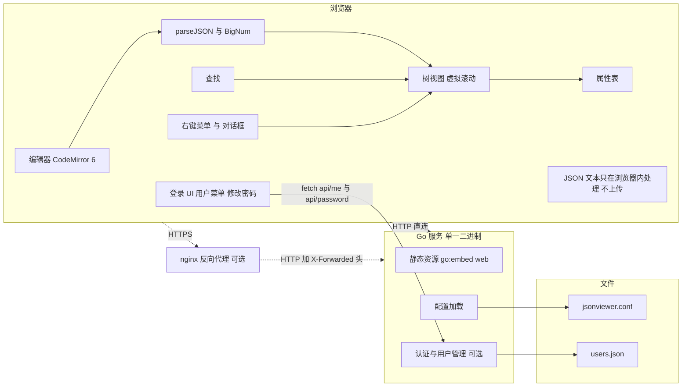
```mermaid
flowchart LR
  subgraph Browser["浏览器"]
    ED["编辑器 CodeMirror 6"]
    PS["parseJSON 与 BigNum"]
    TR["树视图 虚拟滚动"]
    GR["属性表"]
    SE["查找"]
    MN["右键菜单 与 对话框"]
    LG["登录 UI 用户菜单 修改密码"]
    NOTE["JSON 文本只在浏览器内处理 不上传"]
    ED --> PS --> TR --> GR
    SE --> TR
    MN --> TR
  end
  NG["nginx 反向代理 可选"]
  subgraph Server["Go 服务 单一二进制"]
    ST["静态资源 go:embed web"]
    AU["认证与用户管理 可选"]
    CF["配置加载"]
  end
  subgraph Files["文件"]
    CONF["jsonviewer.conf"]
    UF["users.json"]
  end
  Browser -.->|"HTTPS"| NG
  NG -.->|"HTTP 加 X-Forwarded 头"| Server
  Browser -->|"HTTP 直连"| Server
  CF --> CONF
  AU --> UF
  LG -->|"fetch api/me 与 api/password"| AU
```

---

### 3. 目录与模块职责

| 路径 | 职责 |
| --- | --- |
| `main.go` | 入口：`Config`、参数与配置文件解析、`newHandler` 处理链、静态 ETag、访问日志、`--reset-password`、优雅退出 |
| `auth.go` | 认证服务 `authServer`：会话、登录限速、CSRF、路由与页面渲染、`/api/me`、`/api/password` |
| `users.go` | 用户存储 `userStore`：PBKDF2 哈希、用户名校验、`users.json` 读写与外部修改热重载 |
| `proxy.go` | `trusted_proxies` 解析与客户端 IP 判定 |
| `owner_unix.go` / `owner_other.go` | `preserveOwner`：以 root 改写用户文件时沿用旧属主（仅 linux、darwin，其余平台空实现） |
| `templates/` | 认证页面模板：`layout.html`、`login.html`、`setup.html`、`users.html`、`message.html`（`go:embed`，仅启用 `auth` 时解析） |
| `web/index.html` | 查看器页面骨架（三栏、格式下拉、中栏标签页与转换面板、右键菜单、对话框、修改密码弹窗） |
| `web/css/style.css` | 全部样式（查看器与认证页共用） |
| `web/js/app.js` | 查看器 UI 与流程（单个 IIFE）：树、属性表、查找、`check`、转换面板、用户菜单 |
| `web/js/formats.js` | 格式适配器（JSON / YAML / TOML / XML 的解析、输出、识别、XML 映射、懒加载器）与 `BigNum` / `DateVal` / `parseJSON` / `findJsonError` / `stringifyJSON`，暴露全局 `window.JV`（第二部分） |
| `web/js/vendor/codemirror.bundle.js` | 预打包的 CodeMirror 6（含 json / yaml / xml / toml 高亮），暴露全局 `window.CM` |
| `web/js/vendor/yaml.bundle.js` | 预打包的 js-yaml，暴露 `window.JVYaml`；首次用到 YAML 时懒加载 |
| `web/js/vendor/toml.bundle.js` | 预打包的 smol-toml，暴露 `window.JVToml`；首次用到 TOML 时懒加载 |
| `web/assets/ico/` | ExtJS 风格树图标（肘形线、加减号、类型图标）与箭头图标；`purple.gif` 为日期节点图标 |
| `web-src/codemirror-entry.js`、`yaml-entry.js`、`toml-entry.js` + `package.json` | 仅用于重建 vendor 包：`npm i && npm run build:vendor`，或单独 `build:cm` / `build:yaml` / `build:toml`（esbuild，iife，minify） |
| `deploy/` | `jsonviewer.service`、`jsonviewer.conf`、`install.sh`、`nginx.conf.example` |
| `deploy/pages/` | 公共演示站（Cloudflare Pages）的平台专用文件：`_headers`、`404.html`、`robots.txt`；不得放进 `web/`（否则会被 `go:embed` 打进二进制） |
| `LICENSE` | MIT 许可证 |
| `tests/e2e.js` | puppeteer-core + 本机 Chrome 的端到端与大 JSON 性能测试 |
| `tests/formats.js` | 表驱动格式测试（`npm run test:formats`）：YAML / TOML / XML 解析、识别、格式化、互转、往返与损失 |
| `auth_test.go`、`proxy_test.go` | Go 单元测试 |
| `.github/workflows/` | `ci.yml`、`release.yml`、`pages.yml`（v* 标签时发布演示站） |
| `Makefile` | `build`、`run`、`test`、`linux-amd64`、`linux-arm64`、`release`、`clean` |

---

### 4. 前端设计

> 多格式扩展（第二部分）改变了本节的几处：数据层（`BigNum`、`parseJSON`、`findJsonError`、`stringifyJSON`）从 `app.js` 搬到 `formats.js`；`check()` 按格式适配器重写（§12.2）；左栏加格式下拉，中栏加「树视图 | 转换」标签页；根节点文字、左栏标题随当前格式变化。下文以 JSON 为主线描述，涉及处另行注明。

#### 4.1 页面布局

`web/index.html` 为一页三栏，横向 flex 布局（`#app`，四周 4px 内边距）。下表为宽屏（> 1100px）的桌面布局；视口宽度 ≤ 1100px 时的栏宽缩窄与 ≤ 800px 的单栏切换见 §4.9。

| 区域 | 默认宽度 | 内容 |
| --- | --- | --- |
| 左栏「JSON数据」`#leftPanel` | 440px | 标题行（标题随格式显示「YAML数据」等，右侧为格式下拉 `#fmtSelect`）；工具栏（复制 / 格式化 / 删除空格 / 删除空格并转义 / 去除转义，随格式启用或禁用，见 §14.4）+ CodeMirror 编辑器 `#edit` |
| 分割条 `#splitLeft` | 5px | 可拖动 |
| 中栏「视图」`#treePanel` | 自适应 | 标题栏有「树视图 \| 转换」标签，右侧为用户菜单；树视图标签：工具栏（查找框、`GO!`、结果、下一个 / 上一个、全部展开 / 全部收缩、关于）+ 树 `#treeBody`；转换标签：见 §14 |
| 分割条 `#splitRight` | 5px | 可拖动 |
| 右栏「属性」`#gridPanel` | 300px | 「名称 / 值」表格 `#gridRows` |

要点：

- **分割条**：`makeSplitter` 拖动时改面板宽度，最小 120px，最大为 `window.innerWidth - 300`；松开鼠标后调用 `tree.scheduleRender()`。窄屏（≤ 800px）下分割条隐藏。
- **用户菜单**：位于中栏标题栏右侧 `#userMenu`，默认隐藏，仅当 `/api/me` 返回 `auth: true` 且已登录时显示；下拉框用 `position: fixed`，位置由 JS 按按钮计算（避免被面板裁剪），含「修改密码」、「用户管理」（仅管理员）、「退出登录」（POST 表单）。
- **浮层**：右键菜单 `#ctxMenu`、通用对话框 `#dialogMask`、修改密码弹窗 `#pwdMask`、提示 `#toast`；`Escape` 关闭右键菜单、对话框、修改密码弹窗与用户菜单。
- 页面脚本顺序：先加载 `codemirror.bundle.js`（提供 `window.CM`），再加载 `formats.js`（提供 `window.JV`），最后加载 `app.js`；`yaml.bundle.js` / `toml.bundle.js` 由 `formats.js` 按需插入 `<script>`。所有请求用相对路径（`api/me`、`api/password`、`login`、`logout`），因此在 `base_path` 子路径下也能工作。

#### 4.2 模块划分与依赖

`app.js` 是一个 IIFE，内部按对象划分模块。下图按 `app.js` 实际对象命名，只画主要依赖。

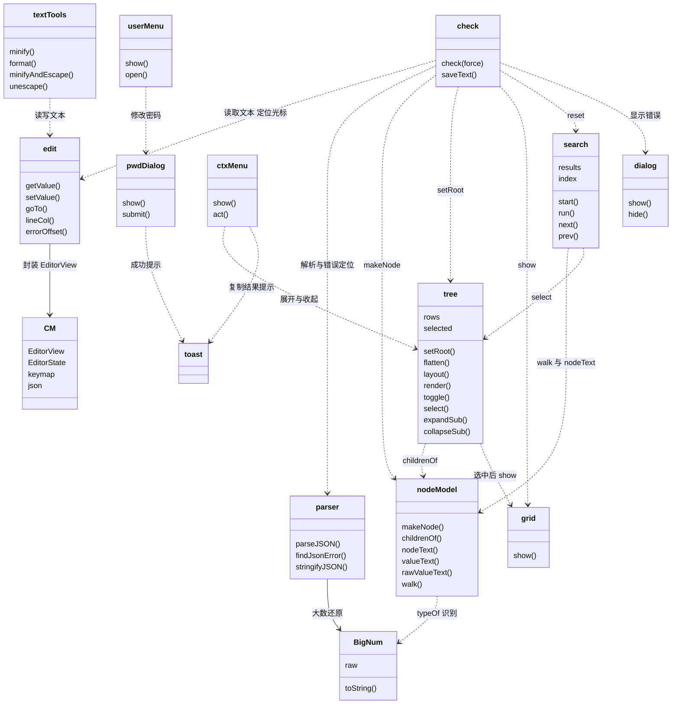
```mermaid
classDiagram
  class CM {
    EditorView
    EditorState
    keymap
    json
  }
  class edit {
    getValue()
    setValue()
    goTo()
    lineCol()
    errorOffset()
  }
  class parser {
    parseJSON()
    findJsonError()
    stringifyJSON()
  }
  class BigNum {
    raw
    toString()
  }
  class nodeModel {
    makeNode()
    childrenOf()
    nodeText()
    valueText()
    rawValueText()
    walk()
  }
  class tree {
    rows
    selected
    setRoot()
    flatten()
    layout()
    render()
    toggle()
    select()
    expandSub()
    collapseSub()
  }
  class grid {
    show()
  }
  class search {
    results
    index
    start()
    run()
    next()
    prev()
  }
  class check {
    check(force)
    saveText()
  }
  class textTools {
    minify()
    format()
    minifyAndEscape()
    unescape()
  }
  class ctxMenu {
    show()
    act()
  }
  class dialog {
    show()
    hide()
  }
  class toast
  class userMenu {
    show()
    open()
  }
  class pwdDialog {
    show()
    submit()
  }
  edit --> CM : 封装 EditorView
  check ..> edit : 读取文本 定位光标
  check ..> parser : 解析与错误定位
  check ..> nodeModel : makeNode
  check ..> tree : setRoot
  check ..> grid : show
  check ..> search : reset
  check ..> dialog : 显示错误
  parser --> BigNum : 大数还原
  nodeModel ..> BigNum : typeOf 识别
  tree ..> nodeModel : childrenOf
  tree ..> grid : 选中后 show
  search ..> nodeModel : walk 与 nodeText
  search ..> tree : select
  ctxMenu ..> tree : 展开与收起
  ctxMenu ..> toast : 复制结果提示
  textTools ..> edit : 读写文本
  userMenu ..> pwdDialog : 修改密码
  pwdDialog ..> toast : 成功提示
```

补充：上图是多格式扩展之前的对象划分；扩展后 `parser`、`BigNum` 位于 `formats.js`（`JV.parseJSON` 等），`check` 经适配器解析，另有转换面板对象 `conv`（约三百余行，仍在 `app.js` 内，未拆出 `convert.js`）。`window.jsonviewer` 暴露 `setText`、`getText`、`parse`、`setFormat`、`getFormat`、`whenIdle`、`showTab`、`convert`、`tree`，供自动化测试和书签脚本使用；`copyToClipboard` 在安全上下文使用 `navigator.clipboard`，否则降级为 `document.execCommand('copy')`。

#### 4.3 核心数据结构：节点模型

每个 JSON 值对应一个普通对象，由 `makeNode(key, value, parent)` 创建。子节点在第一次需要时才由 `childrenOf` 创建（懒创建）。

| 字段 | 含义 |
| --- | --- |
| `key` | 键名；数组元素为下标字符串；根节点为当前格式的标签（`"JSON"` / `"YAML"` / `"TOML"` / `"XML"`，YAML 多文档为「YAML（N 个文档）」） |
| `value` | 原始值（对象、数组、字符串、数字、布尔、`null`，或 `BigNum`） |
| `type` | `object` / `array` / `string` / `number` / `boolean` / `null` / `date`（第二部分新增，`DateVal`）；`BigNum` 归为 `number` |
| `parent` | 父节点，根为 `null` |
| `depth` | 深度，根为 0 |
| `last` | 是否为同级最后一个（决定 `elbow-end` 图标与缩进用空白还是竖线）；默认 `true`，`childrenOf` 对非末位节点设为 `false` |
| `children` | 子节点数组，创建前为 `null` |
| `expanded` | 是否展开；初始 `false`，`setRoot` 时容器根节点设为 `true` |
| `text` | 显示文本缓存：根为 `JSON` 或 `JSON : 值`；容器为 `key`；叶子为 `key : 值`（字符串值带双引号，不转义内容） |
| `indent` | **其子节点**使用的缩进 HTML 前缀缓存（祖先为末位用 `.tb` 空白，否则用 `.tl` 竖线） |
| `row` | 在 `tree.rows` 中的行号，不可见时可能过期，初始 `-1` |

`tree.rows` 是当前可见节点的一维数组，`flatten()` 用显式栈做前序遍历生成（不递归，避免深层 JSON 栈溢出）。`walk(root, fn, createChildren)` 同样非递归。

#### 4.4 关键流程

##### (a) 粘贴 / 失焦 → check() → parseJSON → 建树 → 渲染

下面描述的是 JSON 路径；多格式扩展后 `check()` 先识别或读取手动格式，再交给对应适配器解析（YAML / TOML 首次使用要先懒加载解析库，见 §12.2），JSON 路径的行为不变。

触发方式：粘贴后 `setTimeout 0` 调 `check(false)`；编辑器失焦且文档有改动时 `check(false)`；`Ctrl+Enter` 调 `check(true)`（强制）；「去除转义」按钮在改写文本后立即 `check(false)`。

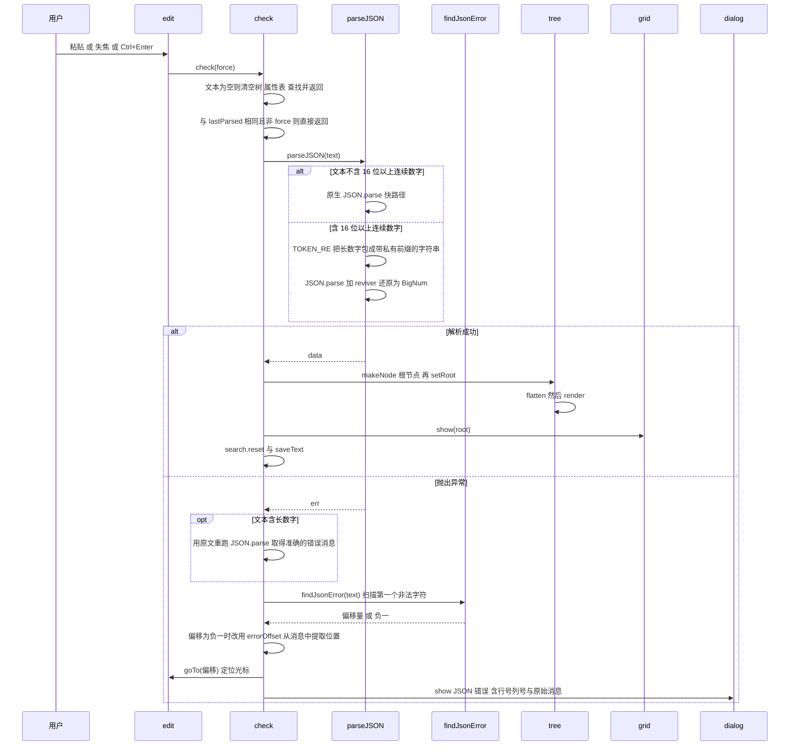
```mermaid
sequenceDiagram
  participant U as 用户
  participant E as edit
  participant C as check
  participant P as parseJSON
  participant F as findJsonError
  participant T as tree
  participant G as grid
  participant D as dialog
  U->>E: 粘贴 或 失焦 或 Ctrl+Enter
  E->>C: check(force)
  C->>C: 文本为空则清空树 属性表 查找并返回
  C->>C: 与 lastParsed 相同且非 force 则直接返回
  C->>P: parseJSON(text)
  alt 文本不含 16 位以上连续数字
    P->>P: 原生 JSON.parse 快路径
  else 含 16 位以上连续数字
    P->>P: TOKEN_RE 把长数字包成带私有前缀的字符串
    P->>P: JSON.parse 加 reviver 还原为 BigNum
  end
  alt 解析成功
    P-->>C: data
    C->>T: makeNode 根节点 再 setRoot
    T->>T: flatten 然后 render
    C->>G: show(root)
    C->>C: search.reset 与 saveText
  else 抛出异常
    P-->>C: err
    opt 文本含长数字
      C->>C: 用原文重跑 JSON.parse 取得准确的错误消息
    end
    C->>F: findJsonError(text) 扫描第一个非法字符
    F-->>C: 偏移量 或 负一
    C->>C: 偏移为负一时改用 errorOffset 从消息中提取位置
    C->>E: goTo(偏移) 定位光标
    C->>D: show JSON 错误 含行号列号与原始消息
  end
```

细节：

| 项 | 说明 |
| --- | --- |
| 大数保护触发条件 | 全文匹配 `/\d{16,}/` 才进入保护路径；`TOKEN_RE` 先匹配字符串（原样保留）再匹配数字，只有含 16 位以上连续数字的数字 token 才被包装 |
| 包装前缀 | `BN_MARK` 为私有区字符 `U+E000` 加 `BN`，reviver 据此还原为 `BigNum`（保存原始文本）；`stringifyJSON` 经 `toJSON` 与 `BN_OUT_RE` 把它还原为裸数字 |
| 错误定位 | 优先用 `findJsonError`（轻量状态机扫描，只在解析失败后运行）；返回 -1 时再从引擎错误消息提取（Chrome 的 `position N`，Firefox 的 `line N column M`） |
| 解析失败时 | 不改动已有的树，也不更新 `lastParsed` |
| 暂存 | 解析成功后 `saveText`：文本小于 2MB 写入 `sessionStorage`，否则删除该键 |

##### (b) 虚拟滚动渲染

浏览器对元素高度有上限，行数过多时滚动区高度封顶，滚动位置按比例换算为「虚拟像素」。`ROW_H = 18`，`MAX_SCROLL_H = 30000000`（Chrome 上限约 3350 万 px）。

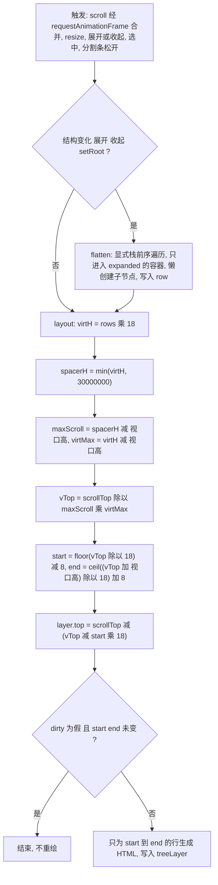
```mermaid
flowchart TD
  A["触发: scroll 经 requestAnimationFrame 合并, resize, 展开或收起, 选中, 分割条松开"] --> B{"结构变化 展开 收起 setRoot ?"}
  B -->|"是"| C["flatten: 显式栈前序遍历, 只进入 expanded 的容器, 懒创建子节点, 写入 row"]
  B -->|"否"| D
  C --> D["layout: virtH = rows 乘 18"]
  D --> E["spacerH = min(virtH, 30000000)"]
  E --> F["maxScroll = spacerH 减 视口高, virtMax = virtH 减 视口高"]
  F --> G["vTop = scrollTop 除以 maxScroll 乘 virtMax"]
  G --> H["start = floor(vTop 除以 18) 减 8, end = ceil((vTop 加 视口高) 除以 18) 加 8"]
  H --> I["layer.top = scrollTop 减 (vTop 减 start 乘 18)"]
  I --> J{"dirty 为假 且 start end 未变 ?"}
  J -->|"是"| K["结束, 不重绘"]
  J -->|"否"| L["只为 start 到 end 的行生成 HTML, 写入 treeLayer"]
```

要点：

- 滚动区内部是 `#treeSpacer`（高度封顶）加绝对定位的 `#treeLayer`，只放可视窗口前后各 8 行的 DOM。
- 无根节点且无行时，显示占位提示「在左侧粘贴 JSON 后，这里显示树形视图。」
- `select(n, true)`（查找跳转用）：展开所有祖先、必要时 `flatten`、`layout`，目标行不在可视范围则用 `scrollToVirtual` 滚到视口中间，然后重绘并刷新属性表。

##### (c) 查找

不区分大小写（统一转大写比较），匹配的是节点的显示文本（含 `key : value`），按文档顺序，上一个 / 下一个循环。

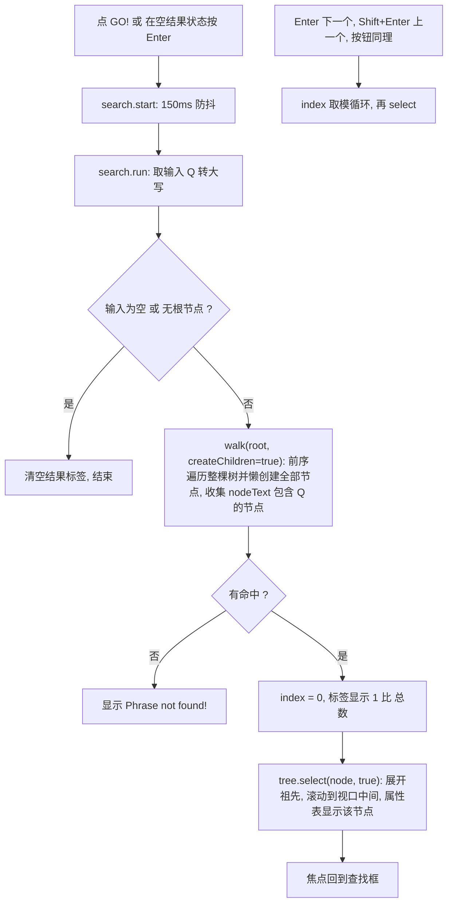
```mermaid
flowchart TD
  A["点 GO! 或 在空结果状态按 Enter"] --> B["search.start: 150ms 防抖"]
  B --> C["search.run: 取输入 Q 转大写"]
  C --> D{"输入为空 或 无根节点 ?"}
  D -->|"是"| Z["清空结果标签, 结束"]
  D -->|"否"| E["walk(root, createChildren=true): 前序遍历整棵树并懒创建全部节点, 收集 nodeText 包含 Q 的节点"]
  E --> F{"有命中 ?"}
  F -->|"否"| G["显示 Phrase not found!"]
  F -->|"是"| H["index = 0, 标签显示 1 比 总数"]
  H --> I["tree.select(node, true): 展开祖先, 滚动到视口中间, 属性表显示该节点"]
  I --> J["焦点回到查找框"]
  K["Enter 下一个, Shift+Enter 上一个, 按钮同理"] --> L["index 取模循环, 再 select"]
```

注意：输入框 `input` 事件会清空结果，所以修改关键字后再按 Enter 会重新查找；重新解析（`check` 成功）会 `search.reset()`。

##### (d) 单击选中与双击展开判定

不依赖浏览器 `dblclick` 事件（`select(n, false)` 只切换 class、不重绘 DOM，保证连续两次点击落在同一元素上，且自行判定更稳定）。

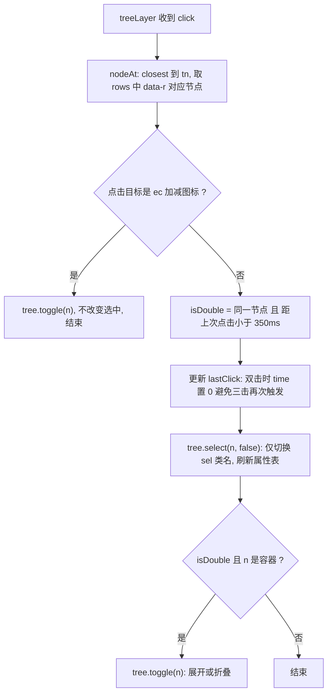
```mermaid
flowchart TD
  A["treeLayer 收到 click"] --> B["nodeAt: closest 到 tn, 取 rows 中 data-r 对应节点"]
  B --> C{"点击目标是 ec 加减图标 ?"}
  C -->|"是"| D["tree.toggle(n), 不改变选中, 结束"]
  C -->|"否"| E["isDouble = 同一节点 且 距上次点击小于 350ms"]
  E --> F["更新 lastClick: 双击时 time 置 0 避免三击再次触发"]
  F --> G["tree.select(n, false): 仅切换 sel 类名, 刷新属性表"]
  G --> H{"isDouble 且 n 是容器 ?"}
  H -->|"是"| I["tree.toggle(n): 展开或折叠"]
  H -->|"否"| J["结束"]
```

补充：`mousedown` 在 `detail > 1` 时 `preventDefault`，避免双击选中文字；右键触发 `contextmenu`，弹出 7 项菜单（复制 Key / Value / Key+Value，展开或收起所有子节点，展开或收起所有节点）。复制 Value：容器给 2 空格缩进的 JSON，字符串不带引号，其余同 `valueText`。

#### 4.5 属性表

选中节点后 `grid.show(n)`：叶子取其父节点；列出该容器所有直接子项（名称 / 值），子容器值显示 `...`；最多渲染 `GRID_MAX_ROWS = 20000` 行，超出显示「… 还有 N 项未显示」。根为叶子（如整个文档是一个数字）时显示一行 `JSON`。

#### 4.6 性能设计要点与实测

| 手段 | 说明 |
| --- | --- |
| 树虚拟化 | DOM 只含可视行 ±8 行；e2e 断言全部展开后 DOM 行数小于 100 |
| 节点懒创建 | 只有展开到的容器才创建子节点；`text`、`indent` 惰性缓存 |
| 非递归遍历 | `flatten`、`walk` 用显式栈 |
| 滚动合并 | `scroll` 经 `requestAnimationFrame` 合并，每帧最多一次 `render` |
| 高度封顶 | 滚动区高度封顶 30,000,000px，按比例换算 |
| 解析快路径 | 无长数字时直接 `JSON.parse`，不做任何文本预处理 |
| 编辑器 | CodeMirror 6 自带视口渲染，textarea 对大文本不可用 |
| 文本工具 | 单趟扫描，累积切片后 `join`，不逐字符拼接 |
| 属性表上限 | 最多 20000 行 |
| 暂存上限 | 超过 2MB 不写 `sessionStorage` |

实测数据：

| 来源 | 数据 |
| --- | --- |
| README | 约 30MB 的 JSON 解析约 1 秒；280 万行全部展开约 0.5 秒 |
| `tests/e2e.js`（默认 `BIG=200000` 条记录，每条含 id、name、email、active、score、tags 数组、meta 对象） | 载入加解析小于 5000ms；全部展开小于 5000ms；格式化小于 15000ms；格式化后重新解析小于 5000ms；另检查滚动到底部显示最后一行、查找末尾节点后可见（这些是阈值，不是实测值） |

#### 4.7 左栏文本工具算法

本节描述 JSON 的文本工具（现位于 `formats.js` 的 JSON 适配器）；YAML / TOML / XML 的格式化与删除空格的行为见 §14.4，对不支持的格式按钮置灰。工具按字符扫描，**跳过字符串内部**（同时识别 `"` 与 `'` 两种引号，`\` 转义下一个字符），对无效 JSON 也能工作，且不改动数字原文。结果通过 `edit.setValue` 写回编辑器；除「去除转义」外不会立即解析，等失焦或粘贴时再解析。

| 工具 | 算法 |
| --- | --- |
| 复制 | 把编辑器全文复制到剪贴板 |
| 删除空格 `minify` | 删除字符串外的空格、制表符、换行、回车（累积切片再 `join`） |
| 格式化 `format` | 先 `minify`，再扫描：`:` 后补一个空格；`,` 后换行并缩进；`{` `[` 后换行并 `level++`，空容器保持 `{}` / `[]`；`}` `]` 前换行，`level` 减 1（不小于 0）后缩进。缩进为每级 **4 个空格**（原站为 2 个） |
| 删除空格并转义 | `minify` 后把 `"` 替换为 `\"` |
| 去除转义 `unescape` | 依次把 `\\` 替换为 `\`、`\"` 替换为 `"`，然后立即 `check(false)` 重新解析 |

#### 4.8 编辑器与启动

| 项 | 说明 |
| --- | --- |
| CodeMirror 配置 | 行号、当前行高亮、撤销历史、选区绘制、括号匹配、语言（放在 `Compartment` 中，随格式在 JSON / YAML / TOML / XML 间切换）、默认高亮、占位文本「将 JSON / YAML / TOML / XML 数据粘贴到这里!」、缩进单位 4 空格 |
| 键位 | `Ctrl-Enter`（mac 为 `Cmd-Enter`）立即解析；默认键位、历史键位、搜索键位（`Ctrl+F` 打开编辑器内文本查找）、`Tab` 缩进 |
| 启动 | 先 `fetch('api/me')`：`401` 跳转 `login`；非 OK 或网络失败按未启用登录处理；`auth` 为真且有用户则显示用户菜单、写入 `#csrfField` 并 `init(user)` |
| 暂存恢复 | `sessionStorage` 键为 `jsonviewer_text:<用户名>`（未启用登录时为 `jsonviewer_text`）；手动指定的格式存于 `jsonviewer_fmt[:<用户名>]`（自动模式不存）；编辑器为空时才恢复；提交退出登录表单时删除该键 |
| 修改密码弹窗 | `FormData` 去掉 `username`、追加 `csrf`，以 urlencoded 形式 `POST api/password`；`401` 跳转登录；成功后关闭弹窗并提示「密码已修改，其它设备需重新登录」 |

#### 4.9 响应式布局

按视口宽度（CSS 媒体查询）切换，不做设备 UA 检测；页面带 `<meta name="viewport" content="width=device-width, initial-scale=1">`。窄屏规则集中在 `style.css` 末尾的两个媒体查询中。

| 视口宽度 | 布局 | 说明 |
| --- | --- | --- |
| > 1100px | 三栏 | 左栏 440px、右栏 300px，分割条可拖动（§4.1） |
| 801–1100px（平板） | 三栏缩窄 | 左栏 320px、右栏 220px；用户拖过分割条写入的内联宽度优先 |
| ≤ 800px（手机） | 单栏 | `#app` 变纵向 flex，顶部出现切换栏 `nav.pane-bar#paneBar`（按钮 `button.pane-tab`：`数据 \| 视图 \| 属性`）；`#app[data-pane=left\|center\|right]`（默认 `left`）决定显示哪一栏，其余栏 `display: none`；分割条隐藏；显示栏的 `flex` / `width` 用 `!important` 覆盖分割条写入的内联宽度（桌面窗口被拖窄时同样适用） |

单栏下的其它调整：面板标题行与转换工具栏允许换行（避免格式下拉、标签、用户菜单被裁掉）；中栏内的「树视图 \| 转换」子标签照常可用；用户管理页（`templates/users.html`）的表格包在 `div.table-scroll` 中横向滚动，单元格不折行。树视图本身样式不变（18px 行、ExtJS 图标、等宽字体），双击行可展开 / 折叠。

重测量：隐藏栏的 `clientHeight` 为 0，树在隐藏期间若重绘，行区间会按 0 高度算错，所以栏重新显示后必须重测量。

- `showPane(name)`：设置 `#app` 的 `data-pane`，同步切换栏按钮的 `on` 与 `aria-selected`，关闭右键菜单、转换选项菜单与用户菜单，然后 `remeasure(name)`。
- `remeasure(pane)`：左栏调编辑器 `view.requestMeasure()`；中栏在「转换」标签下调 `conv.view.requestMeasure()`，否则 `tree.invalidate()`（按真实高度重算行区间）；不传参数则重测所有栏。
- `matchMedia('(max-width: 800px)')` 的 `change` 事件在跨越断点（进入或离开窄屏）时重测所有栏。
- `window.jsonviewer.showPane('left' | 'center' | 'right')` 暴露给测试与调试。

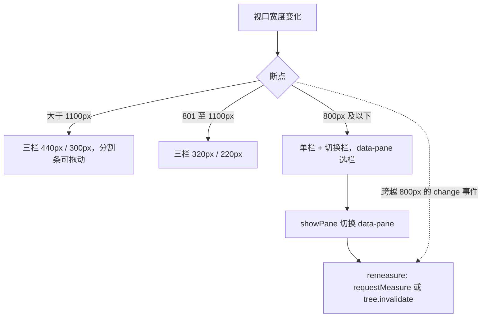
```mermaid
flowchart TD
  w["视口宽度变化"] --> bp{"断点"}
  bp -->|"大于 1100px"| l1["三栏 440px / 300px，分割条可拖动"]
  bp -->|"801 至 1100px"| l2["三栏 320px / 220px"]
  bp -->|"800px 及以下"| l3["单栏 + 切换栏，data-pane 选栏"]
  l3 --> sp["showPane 切换 data-pane"]
  sp --> rm["remeasure: requestMeasure 或 tree.invalidate"]
  bp -.->|"跨越 800px 的 change 事件"| rm
```

已知限制：iOS Safari 没有右键事件，树节点右键菜单在手机上不可用（复制 Key / Value 等需在桌面使用）。

---

### 5. 服务端设计

#### 5.1 配置加载与优先级

优先级：**命令行参数 > 配置文件 > 默认值**。命令行只有「显式给出的」参数才覆盖配置文件（`flag.Visit`）。`-v` / `-e` 在读取配置文件之前处理并退出。

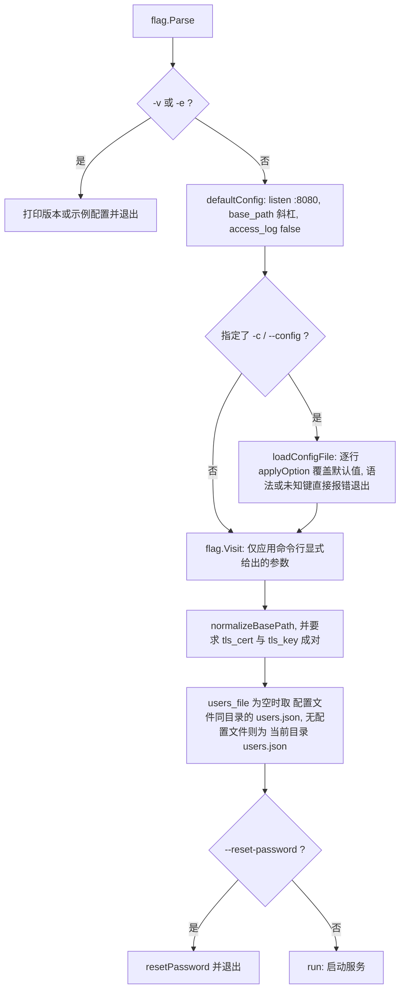
```mermaid
flowchart TD
  S["flag.Parse"] --> V{"-v 或 -e ?"}
  V -->|"是"| VX["打印版本或示例配置并退出"]
  V -->|"否"| D["defaultConfig: listen :8080, base_path 斜杠, access_log false"]
  D --> F{"指定了 -c / --config ?"}
  F -->|"是"| L["loadConfigFile: 逐行 applyOption 覆盖默认值, 语法或未知键直接报错退出"]
  F -->|"否"| P
  L --> P["flag.Visit: 仅应用命令行显式给出的参数"]
  P --> N["normalizeBasePath, 并要求 tls_cert 与 tls_key 成对"]
  N --> U["users_file 为空时取 配置文件同目录的 users.json, 无配置文件则为 当前目录 users.json"]
  U --> R{"--reset-password ?"}
  R -->|"是"| RP["resetPassword 并退出"]
  R -->|"否"| RUN["run: 启动服务"]
```

配置文件格式：`key = value`；空行与以 `#` 或 `;` 开头的行为注释；键名大小写不敏感，`-` 与 `_` 等价；布尔值用 `strconv.ParseBool`；未知键报错。

#### 5.2 参数与配置项

Go 的 `flag` 包同时接受 `-name` 与 `--name`。

| 配置项 | 命令行 | 默认值 | 说明 |
| --- | --- | --- | --- |
| `listen` | `-l`, `--listen` | `:8080` | 监听地址，只想本机访问用 `127.0.0.1:8080` |
| `base_path` | `-b`, `--base-path` | `/` | 反向代理子路径；规范化为以 `/` 开头且无末尾 `/` |
| `access_log` | `-a`, `--access-log` | `false` | 打印访问日志 |
| `tls_cert` | `--tls-cert` | 空 | 证书文件；须与 `tls_key` 同时设置，启用 HTTPS（`ServeTLS`） |
| `tls_key` | `--tls-key` | 空 | 私钥文件 |
| `auth` | `--auth` | `false` | 启用登录验证 |
| `users_file` | `--users-file` | 配置文件同目录 `users.json`，无配置文件时为 `./users.json` | 用户文件路径 |
| `trusted_proxies` | `--trusted-proxies` | 空 | 逗号分隔的 IP 或 CIDR；解析时即校验，非法值报错；给空值会清空列表 |
| 无 | `-c`, `--config` | 空 | 配置文件路径 |
| 无 | `-e`, `--example-config` | - | 输出示例配置并退出 |
| 无 | `-v`, `--version` | - | 显示版本并退出（版本由 `-ldflags -X main.version=...` 注入，默认 `dev`） |
| 无 | `--reset-password <user>` | - | 重置该用户密码（新密码从标准输入读）并退出 |
| 无 | `-h`, `--help` | - | 帮助 |

服务器参数：`ReadHeaderTimeout` 10s、`ReadTimeout` 30s、`WriteTimeout` 60s、`IdleTimeout` 120s；收到 `SIGINT` / `SIGTERM` 后最多等待 5 秒完成在途请求再退出。

#### 5.3 HTTP 处理链

`newHandler` 的顺序固定为：`accessLog` → `base_path` → `requireLogin`（仅启用 `auth`）→ 内层路由 / 静态资源。

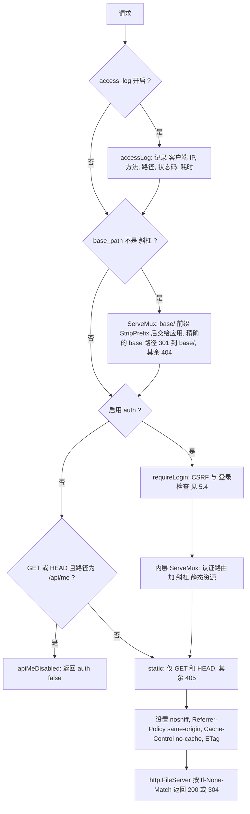
```mermaid
flowchart TD
  REQ["请求"] --> AL{"access_log 开启 ?"}
  AL -->|"是"| ALG["accessLog: 记录 客户端 IP, 方法, 路径, 状态码, 耗时"]
  AL -->|"否"| BP
  ALG --> BP{"base_path 不是 斜杠 ?"}
  BP -->|"是"| SP["ServeMux: base/ 前缀 StripPrefix 后交给应用, 精确的 base 路径 301 到 base/, 其余 404"]
  BP -->|"否"| AU
  SP --> AU{"启用 auth ?"}
  AU -->|"是"| RL["requireLogin: CSRF 与 登录检查 见 5.4"]
  RL --> IN["内层 ServeMux: 认证路由 加 斜杠 静态资源"]
  AU -->|"否"| NA{"GET 或 HEAD 且路径为 /api/me ?"}
  NA -->|"是"| ME0["apiMeDisabled: 返回 auth false"]
  NA -->|"否"| ST
  IN --> ST["static: 仅 GET 和 HEAD, 其余 405"]
  ST --> HDR["设置 nosniff, Referrer-Policy same-origin, Cache-Control no-cache, ETag"]
  HDR --> FS["http.FileServer 按 If-None-Match 返回 200 或 304"]
```

说明：

- 未启用 `auth` 时不经过 `ServeMux`，不做路径规范化，行为与纯静态服务一致；此时 `/login`、`/setup` 等路径就是普通 404。
- 静态资源 ETag：启动时对嵌入的每个文件计算 `sha256` 前 16 位十六进制，格式为弱 ETag `W/"…"`（nginx 开启 gzip 会丢弃强 ETag、保留弱 ETag）；`Cache-Control: no-cache` 表示每次都向服务端确认，内容未变返回 304；目录路径（以 `/` 结尾）按 `index.html` 取 ETag。
- 响应头汇总：

| 响应类型 | 头 |
| --- | --- |
| 静态资源 | `X-Content-Type-Options: nosniff`、`Referrer-Policy: same-origin`、`Cache-Control: no-cache`、`ETag` |
| 认证 HTML 页面 | `Content-Type: text/html`、`Cache-Control: no-store`、`nosniff`、`X-Frame-Options: DENY`、`Referrer-Policy: same-origin` |
| JSON 接口 | `Content-Type: application/json`、`Cache-Control: no-store`、`nosniff` |

#### 5.4 认证与用户管理

##### 用户文件 `users.json`

```json
{
  "version": 1,
  "users": [
    { "name": "admin", "password_hash": "pbkdf2-sha256$210000$<salt_b64>$<hash_b64>", "admin": true, "created_at": "2026-01-01T00:00:00Z" }
  ]
}
```

| 项 | 说明 |
| --- | --- |
| 版本 | 必须为 `1`，否则（含缺失、`2`）启动失败 |
| 写入 | `MarshalIndent`（2 空格），先写临时文件 `users.json.*`，`Sync`、`chmod 0600` 后 `Rename` 原子替换；失败会清理临时文件 |
| 属主 | 以 root 身份写（如 `sudo --reset-password`）时，`preserveOwner` 让新文件沿用旧文件的 uid/gid（仅 linux、darwin） |
| 启动 | 启用 `auth` 且文件不存在时，立即写入空结构：目录不可写时启动阶段就失败，而不是等到 `/setup` |
| 用户名 | 1–32 个字符，仅限 `[A-Za-z0-9_.-]`，区分大小写，创建后不可修改 |
| 密码 | 长度 6 至 1024 字节；存储 `pbkdf2-sha256$<迭代数>$<salt>$<hash>`（`RawStdEncoding` base64） |
| PBKDF2 | 自实现 RFC 8018：HMAC-SHA256，迭代 210000，盐 16 字节，密钥 32 字节；校验按哈希里记录的迭代数（1 至 10,000,000）重算并常量时间比较 |
| 并发 | PBKDF2 计算由容量 4 的信号量限制并发 |
| 防枚举 | 用户不存在时仍对 `dummyHash` 做一次校验，耗时与存在时一致 |
| 管理员保护 | 不能删除或降级最后一个管理员；不能删除自己 |

##### 热重载与 `--reset-password`

- 每个经过 `requireLogin` 的请求先调用 `reloadIfChanged`：比较文件的 inode（`os.SameFile`）、修改时间、大小；变化则重新读入。文件不存在或解析失败时**保留内存数据**（避免误把系统当成未初始化而重新开放 `/setup`）。
- 自己保存后会记录文件状态，避免误判为外部修改。
- `--reset-password <user>`：读取标准输入第一行（终端交互时提示「新密码: 」），长度 6 至 1024，用户必须已存在；写回用户文件后退出。服务运行中执行会被热重载，不需要重启。该参数不要求设置 `auth`，只读 `users_file`。

##### 会话

| 项 | 说明 |
| --- | --- |
| 存储 | 进程内存 `map`，**重启后全部失效** |
| 令牌 | 32 字节 `crypto/rand`，`base64.RawURLEncoding` |
| 有效期 | 7 天滑动：距上次续期超过 1 分钟的请求会续期，并刷新 Cookie |
| Cookie | `jsonviewer_session`：`HttpOnly`、`SameSite=Lax`、`Path` 为 base_path、`Max-Age` 7 天；`Secure` 在配置了 TLS、直连 TLS 或 `X-Forwarded-Proto: https` 时设置 |
| 清理 | 新建会话时顺带清理过期项 |
| 撤销 | 删除用户：该用户全部会话；管理员重置他人密码：该用户全部会话；重置自己的密码或自助改密：除当前会话外的其它会话；用户已不在 `users` 中：该用户会话 |

##### CSRF

双提交令牌：`jsonviewer_csrf` Cookie（`HttpOnly`、`SameSite=Lax`、7 天）的值同时放进表单隐藏字段 `csrf`，所有非 GET / HEAD 请求在 `requireLogin` 中先校验两者一致（常量时间比较）。

- 不依赖 `Origin` / `Referer` / `Host`（非安全上下文下 `Origin` 可能为 `null`，反向代理也可能改写 `Host`）。
- 另有 `Sec-Fetch-Site` 检查：该头存在且为 `cross-site` 或 `same-site` 直接 403；缺失则放行，交给令牌校验。
- 表单体上限 64KB（`MaxBytesReader`）。
- 页面渲染时、`/api/me` 请求时下发令牌（请求已带 Cookie 则沿用）；查看器页面是静态的，由前端从 `/api/me` 取 `csrf` 写入 `#csrfField`。
- 拒绝时，浏览器页面请求（`Accept` 含 `text/html`）返回认证页样式的 403，否则纯文本。

##### 登录限速

| 项 | 说明 |
| --- | --- |
| 键 | `ip:<客户端 IP>` 与 `user:<用户名>` 两个键，任一被锁即拒绝 |
| 规则 | 连续失败 10 次后锁定 60 秒（返回 429）；距上次失败超过 15 分钟则计数清零；登录成功清除两个键 |
| 存储 | 内存，重启清零；条目超过 10000 时顺带清理过期项 |
| 顺序 | 先判断是否锁定（不做 PBKDF2），再校验密码 |

##### `trusted_proxies` 与客户端 IP

`clientIP` 用于限速与日志：

1. 未配置，或直连来源（`RemoteAddr`）不在列表内：用 `RemoteAddr`。
2. 在列表内：取 `X-Forwarded-For`（多个头合并）**从右往左第一个不可信地址**，全部可信则取最左；任一值无法解析则回退到 `RemoteAddr`。
3. 没有 `X-Forwarded-For` 时用 `X-Real-IP`；仍无则回退。
4. 地址统一去掉 IPv4 映射前缀和 zone，允许带端口。

反向代理后不设置 `trusted_proxies`，限速会把所有人算成代理自身的 IP。

##### 路由表（启用 `auth`）

权限列：公开 = 不需登录；登录 = 需有效会话；管理员 = 需 `admin`。未列出的路径一律走静态资源，需要登录（`/css/`、`/assets/` 除外）。

| 方法 | 路径 | 权限 | 说明 |
| --- | --- | --- | --- |
| GET | `/setup` | 公开 | 无用户时显示创建管理员页；已有用户则 302 到登录页 |
| POST | `/setup` | 公开 | 校验用户名与密码（含确认），创建首个管理员并自动登录；已有用户时（如并发重复提交）302 到登录页 |
| GET | `/login` | 公开 | 无用户 302 到 `setup`；已登录 302 到站点根；否则显示登录页 |
| POST | `/login` | 公开 | 登录，限速，成功 302 到站点根；失败 401，被限速 429 |
| POST | `/logout` | 登录 | 删除会话、清 Cookie，302 到登录页 |
| GET | `/admin/users` | 管理员 | 用户列表页 |
| POST | `/admin/users/add` | 管理员 | 新增用户（可勾选管理员） |
| POST | `/admin/users/delete` | 管理员 | 删除用户，不能删自己与最后一个管理员，撤销其会话 |
| POST | `/admin/users/password` | 管理员 | 重置指定用户密码并撤销其会话（自己则保留当前会话） |
| POST | `/admin/users/admin` | 管理员 | 设置或取消管理员（`admin=true/false`） |
| GET | `/api/me` | 公开 | 返回 `{auth, user, admin, csrf}`；未登录为 401 并带 `csrf` |
| POST | `/api/password` | 登录 | JSON 接口，校验当前密码，写入新密码并撤销其它会话 |
| GET / HEAD | 其它 | 登录（`/css/`、`/assets/` 公开） | 静态资源；`/api/` 开头未登录返回 JSON 401，其它跳转 |

未启用 `auth` 时只有 `/api/me`（GET / HEAD）：返回 `{"auth":false}`。认证页面（`/setup`、`/login`、`/admin/users`）与查看器内的文案固定为中文。

##### 访问状态

下图描述启用 `auth` 后，一个访问者所处的状态与转换。

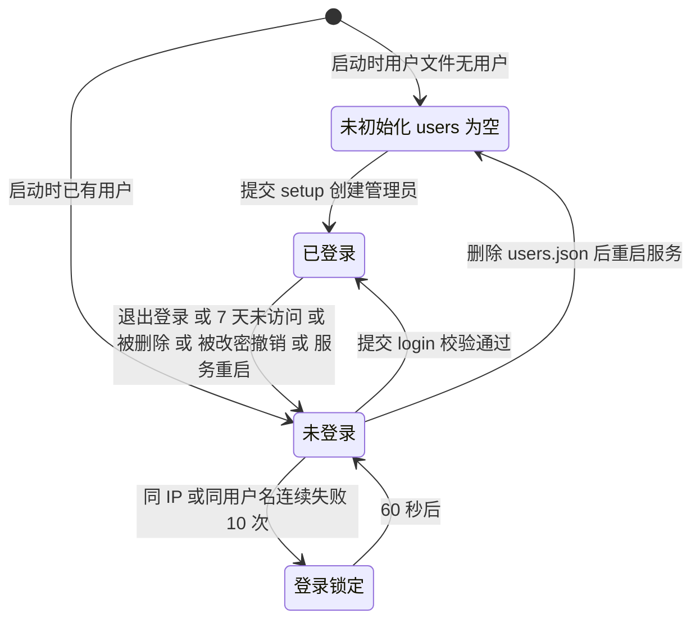
```mermaid
stateDiagram-v2
  state "未初始化 users 为空" as S0
  state "未登录" as S1
  state "登录锁定" as S3
  state "已登录" as S2
  [*] --> S0 : 启动时用户文件无用户
  [*] --> S1 : 启动时已有用户
  S0 --> S2 : 提交 setup 创建管理员
  S1 --> S2 : 提交 login 校验通过
  S1 --> S3 : 同 IP 或同用户名连续失败 10 次
  S3 --> S1 : 60 秒后
  S2 --> S1 : 退出登录 或 7 天未访问 或 被删除 或 被改密撤销 或 服务重启
  S1 --> S0 : 删除 users.json 后重启服务
```

各状态下的访问行为：

| 状态 | 访问查看器 / 静态资源 | 访问 `/api/*` | 访问 `/login` | 访问 `/setup` |
| --- | --- | --- | --- | --- |
| 未初始化 | 302 到 `setup` | 401 JSON（`/api/me` 公开，返回 401 与 `csrf`） | 302 到 `setup` | 显示创建管理员页 |
| 未登录 | 302 到 `login`（`/css/`、`/assets/` 仍可访问） | 401 JSON | 显示登录页 | 302 到 `login` |
| 已登录 | 正常 | 正常 | 302 到站点根 | 302 到 `login` |

##### `requireLogin` 的判定顺序

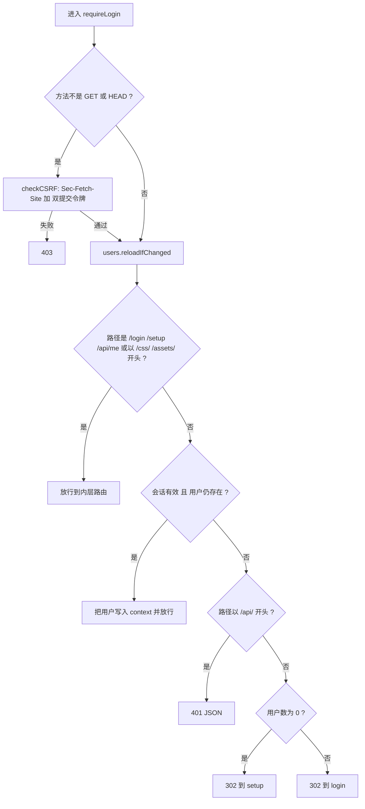
```mermaid
flowchart TD
  A["进入 requireLogin"] --> B{"方法不是 GET 或 HEAD ?"}
  B -->|"是"| C["checkCSRF: Sec-Fetch-Site 加 双提交令牌"]
  C -->|"失败"| X["403"]
  C -->|"通过"| D
  B -->|"否"| D["users.reloadIfChanged"]
  D --> E{"路径是 /login /setup /api/me 或以 /css/ /assets/ 开头 ?"}
  E -->|"是"| PASS["放行到内层路由"]
  E -->|"否"| F{"会话有效 且 用户仍存在 ?"}
  F -->|"是"| G["把用户写入 context 并放行"]
  F -->|"否"| H{"路径以 /api/ 开头 ?"}
  H -->|"是"| J["401 JSON"]
  H -->|"否"| K{"用户数为 0 ?"}
  K -->|"是"| S["302 到 setup"]
  K -->|"否"| L["302 到 login"]
```

##### 登录时序

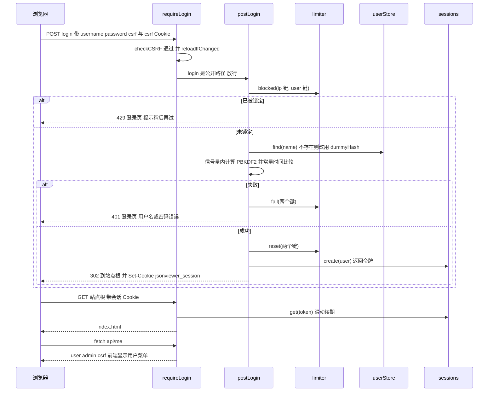
```mermaid
sequenceDiagram
  participant B as 浏览器
  participant R as requireLogin
  participant H as postLogin
  participant L as limiter
  participant US as userStore
  participant SS as sessions
  B->>R: POST login 带 username password csrf 与 csrf Cookie
  R->>R: checkCSRF 通过 并 reloadIfChanged
  R->>H: login 是公开路径 放行
  H->>L: blocked(ip 键, user 键)
  alt 已被锁定
    H-->>B: 429 登录页 提示稍后再试
  else 未锁定
    H->>US: find(name) 不存在则改用 dummyHash
    H->>H: 信号量内计算 PBKDF2 并常量时间比较
    alt 失败
      H->>L: fail(两个键)
      H-->>B: 401 登录页 用户名或密码错误
    else 成功
      H->>L: reset(两个键)
      H->>SS: create(user) 返回令牌
      H-->>B: 302 到站点根 并 Set-Cookie jsonviewer_session
    end
  end
  B->>R: GET 站点根 带会话 Cookie
  R->>SS: get(token) 滑动续期
  R-->>B: index.html
  B->>R: fetch api/me
  R-->>B: user admin csrf 前端显示用户菜单
```

---

### 6. 部署与运维

#### 6.1 单二进制与运行方式

`make build` 产出静态二进制 `jsonviewer`（`CGO_ENABLED=0`，`-trimpath`，`-s -w`，注入版本号）。直接运行即可：`./jsonviewer -l 127.0.0.1:8080`；用配置文件：`./jsonviewer -c /etc/jsonviewer/jsonviewer.conf`。生成配置模板：`./jsonviewer --example-config > jsonviewer.conf`。

#### 6.2 systemd 单元要点（`deploy/jsonviewer.service`）

| 项 | 值 |
| --- | --- |
| 启动命令 | `/usr/local/bin/jsonviewer -config /etc/jsonviewer/jsonviewer.conf` |
| 重启策略 | `Restart=on-failure`，`RestartSec=3s` |
| 运行身份 | `User=jsonviewer`，`Group=jsonviewer`（需先创建：`useradd -r -s /usr/sbin/nologin jsonviewer`） |
| 加固 | `NoNewPrivileges`、`ProtectSystem=strict`、`ProtectHome`、`PrivateTmp`、`PrivateDevices`、`ProtectKernelTunables`、`ProtectControlGroups`、`RestrictAddressFamilies=AF_INET AF_INET6` |
| 可写路径 | `ReadWritePaths=/etc/jsonviewer`（启用 `auth` 后要在该目录原子替换 `users.json`，目录必须可写） |
| 特权端口 | 监听 1024 以下端口时取消注释 `AmbientCapabilities=CAP_NET_BIND_SERVICE` |

#### 6.3 一键安装 `deploy/install.sh`

脚本只安装文件，不启动服务；没有命令行参数，版本固定取 GitHub 最新 Release。环境变量 `JSONVIEWER_ROOT` 可改安装根目录（非 `/` 时跳过创建用户与 `systemctl`，仅用于测试）。

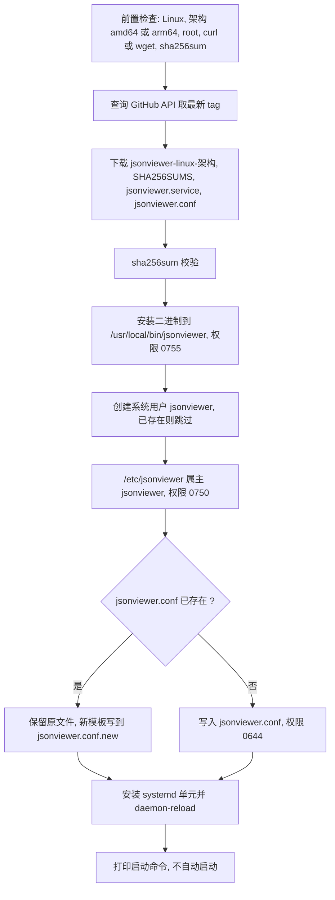
```mermaid
flowchart TD
  A["前置检查: Linux, 架构 amd64 或 arm64, root, curl 或 wget, sha256sum"] --> B["查询 GitHub API 取最新 tag"]
  B --> C["下载 jsonviewer-linux-架构, SHA256SUMS, jsonviewer.service, jsonviewer.conf"]
  C --> D["sha256sum 校验"]
  D --> E["安装二进制到 /usr/local/bin/jsonviewer, 权限 0755"]
  E --> F["创建系统用户 jsonviewer, 已存在则跳过"]
  F --> G["/etc/jsonviewer 属主 jsonviewer, 权限 0750"]
  G --> H{"jsonviewer.conf 已存在 ?"}
  H -->|"是"| I["保留原文件, 新模板写到 jsonviewer.conf.new"]
  H -->|"否"| J["写入 jsonviewer.conf, 权限 0644"]
  I --> K["安装 systemd 单元并 daemon-reload"]
  J --> K
  K --> L["打印启动命令, 不自动启动"]
```

手动安装的步骤（建用户、复制二进制、准备配置、安装单元、`chown jsonviewer:jsonviewer /etc/jsonviewer`）见 README。

#### 6.4 nginx 反向代理（`deploy/nginx.conf.example`）

下图是推荐的部署拓扑。

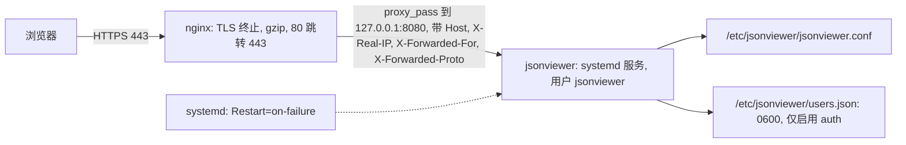
```mermaid
flowchart LR
  C["浏览器"] -->|"HTTPS 443"| N["nginx: TLS 终止, gzip, 80 跳转 443"]
  N -->|"proxy_pass 到 127.0.0.1:8080, 带 Host, X-Real-IP, X-Forwarded-For, X-Forwarded-Proto"| J["jsonviewer: systemd 服务, 用户 jsonviewer"]
  J --> CF["/etc/jsonviewer/jsonviewer.conf"]
  J --> UF["/etc/jsonviewer/users.json: 0600, 仅启用 auth"]
  SD["systemd: Restart=on-failure"] -.-> J
```

| 要点 | 说明 |
| --- | --- |
| 监听 | jsonviewer 的 `listen` 改为 `127.0.0.1:8080`，避免绕过 nginx 直连 |
| 必留请求头 | `Host`（日志与重定向）、`X-Forwarded-Proto`（登录 Cookie 才带 `Secure`） |
| 真实 IP | 启用 `auth` 时在 jsonviewer 配置中设 `trusted_proxies = 127.0.0.1`，登录限速才按真实客户端 IP 计数 |
| 子路径 | nginx `location /jsonviewer/` 的 `proxy_pass` 不带路径（前缀原样传给后端），同时 jsonviewer 设 `base_path = /jsonviewer` |
| 请求体大小 | JSON 内容不上传，无需调大 `client_max_body_size` |
| gzip | 服务端用弱 ETag，gzip 后浏览器仍可 304 |

#### 6.5 升级与恢复

| 场景 | 操作 |
| --- | --- |
| 升级 | 替换二进制后 `sudo systemctl restart jsonviewer`；浏览器通过 ETag 自动取新版前端，无需清缓存；也可重跑一键安装脚本（配置不会被覆盖）。重启会使所有登录会话失效 |
| 忘记密码 | `echo '新密码' \| sudo -u jsonviewer jsonviewer -c /etc/jsonviewer/jsonviewer.conf --reset-password admin`，运行中的服务自动热加载，无需重启 |
| 重新初始化 | 删除 `users.json` 后**重启服务**，访问 `/setup` 重新创建管理员（运行中删除文件，内存数据保留，不会重新开放 `/setup`） |
| 备份 | 只需备份 `jsonviewer.conf` 与 `users.json` |
| 启动失败 | 启用 `auth` 但进程无法写入 `users_file` 所在目录会在启动阶段报错退出（手动安装需自行 `chown jsonviewer:jsonviewer /etc/jsonviewer`） |

#### 6.6 公共演示站（静态托管）

前端的解析、转换都在浏览器内完成，后端只负责提供静态文件（认证为可选功能，演示站不启用），因此 `web/` 可原样作为纯静态站托管，无需任何服务端逻辑。部署流水线：`pages.yml` 在推送 `v*` 标签时，把 `web/` 与 `deploy/pages/`（`_headers`、`404.html`、`robots.txt`）拼成 `dist-pages/`，直传 Cloudflare Pages；它与 `release.yml` 并行运行，互不依赖。演示站须保持纯静态、不加统计。地址暂定 `https://jsonviewer-c7d.pages.dev`（项目名被占用时会变），详情见 [DEMO_SITE_CN.md](DEMO_SITE_CN.md)。

---

### 7. 构建、测试与发布

#### 7.1 Makefile 目标

| 目标 | 作用 |
| --- | --- |
| `build` | `CGO_ENABLED=0 go build -trimpath -ldflags "-s -w -X main.version=$(VERSION)" -o jsonviewer .`；`VERSION` 默认取 `git describe --tags --always --dirty`，取不到为 `dev` |
| `run` | 先 `build`，再以 `-listen 127.0.0.1:8080 -access-log` 启动 |
| `test` | `go vet ./... && go test ./...` |
| `linux-amd64` / `linux-arm64` | 交叉编译到 `dist/jsonviewer-linux-<arch>` |
| `release` | 依赖上面两个目标 |
| `clean` | 删除二进制与 `dist` |

重建前端依赖（仅在升级依赖或改 `web-src/` 入口时）：`npm install && npm run build:vendor`，产物为 `web/js/vendor/` 下的 `codemirror.bundle.js`、`yaml.bundle.js`、`toml.bundle.js`；也可单独运行 `build:cm` / `build:yaml` / `build:toml`。

#### 7.2 单元测试覆盖点

| 文件 | 覆盖 |
| --- | --- |
| `auth_test.go` | PBKDF2 的 RFC 向量与多块输出；哈希格式、盐随机、畸形哈希与超长密码拒绝；用户存储往返（权限 `0600`、无残留临时文件、列表按创建时间排序、最后一个管理员保护）；`setupAdmin` 仅一次；损坏或版本不符的文件加载失败；用户名校验；CSRF 九种组合（含 `Origin: null`、外域 `Origin`、`Sec-Fetch-Site`）、HTML 403、`/api/me` 返回令牌；静态 ETag 与 304（启用与未启用 `auth`）；`siteBase`；会话撤销；登录限速；`reloadIfChanged`（自己保存、外部改密、不覆盖外部改动、直接改写、损坏或删除后保留内存数据）；`/api/password`（未登录 401、三种校验错误、成功与其它会话撤销）与 `/account` 已移除为 404 |
| `proxy_test.go` | `clientIP` 十六种情形（未配置、不可信来源、IPv6、IPv4 映射、CIDR、伪造多级 XFF、多个 XFF 头、端口、`X-Real-IP`、非法值回退）；`trusted_proxies` 选项的解析与非法值拒绝 |
| 未覆盖 | `run`、配置文件加载、`base_path` 处理链、`resetPassword`、前端逻辑（后者由 e2e 覆盖） |

#### 7.3 e2e 用例分组（`tests/e2e.js`）

启动已编译的 `./jsonviewer`，用 `puppeteer-core` 驱动本机 Chrome（环境变量 `CHROME`，默认 `/usr/bin/google-chrome`）。`BIG=0` 跳过性能部分。下表是多格式扩展之前的分组；扩展后另增「多格式查看」「转换」两组（§18.2），格式的表驱动测试在独立的 `tests/formats.js`（`npm run test:formats`，同样启动 `./jsonviewer` 并用 headless Chrome，因 XML 依赖 `DOMParser`），分组为 YAML / TOML / XML 解析、格式化、识别、往返、损失（→ TOML / → XML / → JSON）。

| 分组 | 内容 |
| --- | --- |
| 功能（未启用 auth） | 页面加载；根节点展开；大整数不丢精度；字符串引号与 HTML 转义；属性表；全部展开 / 收缩；双击展开折叠；查找命中、未命中；右键菜单 7 项；复制提示；格式化、删除空格、转义、去转义；粘贴与失焦自动解析；错误对话框含行列；分割条拖动 |
| 性能（`BIG` 默认 200000） | 载入解析、全部展开且 DOM 行数受控、滚动到底、查找末尾节点、格式化、重新解析 |
| 移动端布局 | 390x844 移动视口：无横向溢出；切换栏显示；数据 / 视图 / 属性三栏可切换；树有行；转换工具栏不溢出；属性表有行；恢复 1400x800 后三栏可见且重绘 |
| 接口与错误 | 未启用登录时 `/api/me` 返回 `{"auth":false}` 且用户菜单隐藏；无页面错误 |
| 登录验证（第二个实例） | 另起 `auth = true` 实例，监听 `0.0.0.0` 并通过本机局域网 IPv4 访问（模拟非安全上下文）；独立 BrowserContext；覆盖：未登录跳转 `/setup`、`app.js` 受保护而样式公开、创建管理员、用户菜单、`/api/me`、ETag 与 304、`/setup` 不再可用、`/account` 已移除、修改密码弹窗（错误与成功）、新增用户、不能删除自己、退出清除暂存内容、普通用户菜单与 `/admin/users` 403、连续 10 次错误后第 11 次 429、无页面错误 |

#### 7.4 CI 与 Release 工作流

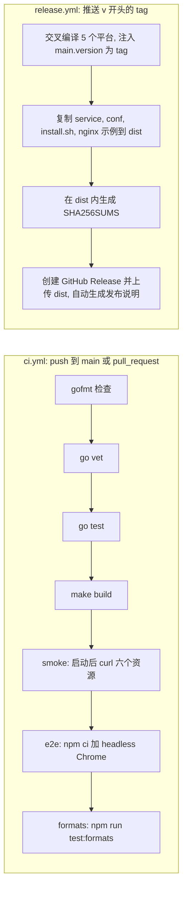
```mermaid
flowchart LR
  subgraph CI["ci.yml: push 到 main 或 pull_request"]
    direction TB
    c1["gofmt 检查"] --> c2["go vet"] --> c3["go test"] --> c4["make build"] --> c5["smoke: 启动后 curl 六个资源"] --> c6["e2e: npm ci 加 headless Chrome"] --> c7["formats: npm run test:formats"]
  end
  subgraph REL["release.yml: 推送 v 开头的 tag"]
    direction TB
    r1["交叉编译 5 个平台, 注入 main.version 为 tag"] --> r2["复制 service, conf, install.sh, nginx 示例到 dist"] --> r3["在 dist 内生成 SHA256SUMS"] --> r4["创建 GitHub Release 并上传 dist, 自动生成发布说明"]
  end
```

| 工作流 | 要点 |
| --- | --- |
| `ci.yml` | `ubuntu-24.04`；`actions/checkout@v7`、`actions/setup-go@v7`（`go-version-file: go.mod`，`cache: false`）；smoke 在 `127.0.0.1:18080` 请求 `/`、`/js/app.js`、`/js/vendor/codemirror.bundle.js`、`/js/formats.js`、`/js/vendor/yaml.bundle.js`、`/js/vendor/toml.bundle.js`；e2e 与 formats 两步都用 `which google-chrome` 或 `chromium` 找 Chrome（先 `npm ci` 一次） |
| `release.yml` | 权限 `contents: write`；目标 `linux/amd64`、`linux/arm64`、`darwin/amd64`、`darwin/arm64`、`windows/amd64`（`.exe`）；附件含二进制、`jsonviewer.service`、`jsonviewer.conf`、`install.sh`、`nginx.conf.example`、`SHA256SUMS`；使用 `softprops/action-gh-release@v3`；发布前不重跑测试 |
| `pages.yml` | 与 `release.yml` 同为推送 `v*` 标签触发、并行运行；把 `web/` 与 `deploy/pages/` 拼成 `dist-pages/` 后直传 Cloudflare Pages（演示站，见 §6.6） |

---

### 8. 已知限制与设计取舍

| 主题 | 说明 |
| --- | --- |
| 与原站的差异 | 格式化缩进为 4 空格（原站 2 空格）；双击展开自行判定而非依赖 `dblclick`；超过 16 位的数字按原文保留；去除转义后立即重新解析、失焦解析（对应原站 `change` 事件）与原站保持一致；整体改为清爽浅色主题，仅树视图保持 ExtJS 结构；无广告、无统计 |
| 会话仅在内存 | 服务重启后所有人需重新登录；仅适合单实例；限速计数同样重启清零 |
| 命令行重置密码不撤销会话 | `--reset-password` 只改 `users.json`，运行中服务热加载新哈希，但已有会话不会被撤销（会话按用户名关联，无需密码）；需要踢出已登录会话时请重启服务或在 `/admin/users` 页面重置密码 |
| 页面文案固定中文 | 查看器、认证页、错误消息均无多语言机制 |
| 展开全部与查找会创建整棵树 | 懒创建只对「逐级展开」有效；「全部展开」与查找需要遍历全部节点，超大 JSON 内存占用随节点数线性增长 |
| 属性表与暂存上限 | 属性表最多 20000 行；超过 2MB 的文本不暂存到 `sessionStorage` |
| 滚动精度 | 行数极大时滚动区高度封顶 30,000,000px，滚动条一像素对应多行 |
| 解析严格 | JSON 使用 `JSON.parse`，不支持注释、单引号、尾逗号（YAML / TOML / XML 由各自的解析器决定，识别为 `{` 开头的文本不会回退按 YAML 解析）；JSON 的文本工具（格式化 / 删除空格）对非法 JSON 仍可工作，其它格式的格式化需要先解析成功 |
| 安全边界 | `Secure` Cookie 依据 TLS 或 `X-Forwarded-Proto: https` 判断，不受 `trusted_proxies` 约束；静态页没有 `X-Frame-Options`（仅认证页设置 `DENY`）；没有 CSP |
| 用户模型 | 无自助注册，用户名创建后不可改，没有「记住我」与会话列表 |
| 平台 | 部署文档与一键安装仅覆盖 Linux + systemd；Release 附带 macOS 与 Windows 二进制；`preserveOwner` 仅在 linux、darwin 生效，Windows 为空实现 |
| 代码与 README 不一致 | 见下方列表 |

文档与代码核对中发现的差异：

1. README 的 `make release` 描述只涉及 linux amd64 与 arm64，而 `release.yml` 实际构建 5 个平台；两者用途不同（本地交叉编译与正式发布），不算冲突，但读者易误解。
2. README 称管理员重置密码会使会话立即失效，这对 `/admin/users` 页面操作成立，对命令行 `--reset-password` 不成立（见上表）。

（编写本文档时还发现 README 中「一键安装脚本可加 `-v` 指定版本」与示例配置缺少 `trusted_proxies` 两处错误，已在 README 中直接修正。）

---

## 第二部分 多格式扩展设计（已实现）

> 本部分最初是设计方案，现已按其实现（P0–P3 已完成，P4 文档进行中，见 §19）。实现与设计的差异记录在 §22，以 §22 与代码为准。结论：**服务端零改动**。YAML 用 js-yaml、TOML 用 smol-toml（两者拆成独立 vendor 包按需懒加载），XML 用浏览器原生 `DOMParser` 加手写序列化器；四种格式解析后都落到现有的 JS 值模型（只新增一个 `date` 叶子类型）；格式互转采用「中栏标签页」方案（见 §14）；JSON 路径只多一次首字符判断。
>
> 文中的体积、行为与耗时数据，除特别标注「未实测」的以外，均为方案设计阶段用项目自带的 esbuild 与本机 headless Chrome 实测所得（数据集与 `tests/e2e.js` 性能测试同构）；落地后的实测数据见 §22。

### 9. 目标与范围

| 项 | 说明 |
| --- | --- |
| 目标 | 查看器从 JSON 扩展到 JSON / YAML / TOML / XML 四种格式：都能解析成树、属性表与查找可用、语法高亮与错误定位到位；并在界面上支持四种格式之间互相转换 |
| 不变的约束 | Go 只用标准库；前端原生 JS、不引框架、不走 CDN，第三方库经 `web-src` + esbuild 打包进 `web/js/vendor`；树视图保持虚拟滚动与节点懒创建；三栏布局不变；可选登录功能不受影响 |
| 性能底线 | JSON 仍走原生 `JSON.parse` 快速路径，大 JSON 的各项性能指标零退化（§16.3） |
| 服务端 | **确认无需改动**。`//go:embed web` 自动包含新文件；`staticETags` 自动覆盖；登录门禁只放行 `/css/` 与 `/assets/`，`/js/` 下的新文件与 `app.js` 一样受保护；服务端未设置 CSP，动态插入同源 `<script>` 不受限。二进制约增大 150 KB |
| 非目标 | 打开本地文件、拖拽文件；Web Worker 解析；XML 映射约定的可配置化；保留注释的 YAML / TOML 重排 |

### 10. 库选型

#### 10.1 解析库实测对比

体积为 `esbuild --bundle --minify --format=iife` 产物，gz 为 `gzip -9`。

| 候选 | 版本 | 许可证 | 最近发布 | min | gz | 5MB 级解析耗时 | 结论 |
| --- | --- | --- | --- | --- | --- | --- | --- |
| js-yaml | 5.4.2 | MIT | 2026-09-13 | 60.4 KB | 18.1 KB | load 5.2MB 约 0.28–0.33 s；dump 约 0.48–0.59 s | **采用** |
| yaml (eemeli) | 2.9.1 | ISC | 2026-09-11 | 103.9 KB | 32.0 KB | parse 5.2MB 约 2.1–2.5 s；stringify 约 1.2 s | 不采用（慢约 7 倍、大 70%） |
| smol-toml | 1.9.0 | BSD-3-Clause | 2026-09-22 | 16.7 KB | 6.5 KB | parse 4.6MB 约 0.18–0.25 s；stringify 约 0.11–0.18 s | **采用** |
| @iarna/toml | 2.2.5 | ISC | 2023 年后无更新 | 未测 | 未测 | 未测 | 不采用（停更） |
| @ltd/j-toml | 1.38.0 | LGPL-3.0 | 2023 年后无更新 | 未测 | 未测 | 未测 | 不采用（许可证、停更） |
| DOMParser（原生） | 浏览器内置 | 无 | 无 | 0 | 0 | 7.66MB：DOM 0.49 s + 转对象 0.33 s ≈ 0.8 s | **采用** |
| fast-xml-parser | 5.11.2 | MIT | 2026-09-29 | 77.6 KB | 24.6 KB | 7.66MB 约 0.66–0.80 s（不含校验） | 不采用 |

参照：`JSON.parse` 4.08MB 约 20 ms。

选型理由：

- **YAML 选 js-yaml 5**。性能是本项目硬约束，它比 `yaml` 快约 7 倍、小 40%，声称通过完整 YAML Test Suite，默认 YAML 1.2 core schema。大数保护、合并键、未知标签兜底、错误偏移都已实测可行（见 §11、§17）。风险是 5.0.0 于 2026-06-20 才发布，属重写后的新大版本，近三个月仍在发补丁；应对是锁死精确版本（不带 `^`），且适配器接口把库隔离，必要时可换回 `yaml` 2.x。
- **TOML 选 smol-toml**。体积最小、维护活跃、零依赖、支持 `integersAsBigInt`。
- **XML 选原生 DOMParser**。速度与 fast-xml-parser 持平而体积为零，天然做良构性校验并给出行列号；fast-xml-parser 默认不校验，且带 6 个运行时依赖。XML 输出不用 `XMLSerializer`（它不做缩进，还要先建 DOM），改为从对象模型直接拼字符串的手写序列化器，约 80 行。

#### 10.2 CodeMirror 语言包

| 包 | 版本 | 许可证 | 用途 |
| --- | --- | --- | --- |
| @codemirror/lang-yaml（依赖 @lezer/yaml 1.0.4） | 6.1.3 | MIT | `yaml()` |
| @codemirror/lang-xml（依赖 @lezer/xml 1.0.6） | 6.1.0 | MIT | `xml()` |
| @codemirror/legacy-modes | 6.5.4 | MIT | `StreamLanguage.define(toml)`，只引 `mode/toml` |

实测把三者并入现有 CodeMirror 包：346,152 → 382,138 字节（+36.0 KB；gz 112.4 → 125.4 KB，+13.0 KB）。

**结论：语言包不拆，直接并入 `codemirror.bundle.js`。** 单独拆出来会重复打包 @lezer/lr 和 @codemirror/language（单独一个 yaml 语言包实测 277 KB），或者要把整套构建改成 ESM 分块，得不偿失。

#### 10.3 vendor 拆分与懒加载

| 文件 | 内容 | 体积 | 加载时机 |
| --- | --- | --- | --- |
| `web/js/vendor/codemirror.bundle.js` | 现有内容 + yaml / xml / toml 高亮 + `StreamLanguage` | 约 382 KB | 首屏（同步，与现在一致） |
| `web/js/vendor/yaml.bundle.js` | js-yaml，暴露 `window.JVYaml` | 约 60 KB | 首次识别到 YAML，或首次选 YAML 为转换目标 |
| `web/js/vendor/toml.bundle.js` | smol-toml，暴露 `window.JVToml` | 约 17 KB | 同上（TOML） |
| `web/js/formats.js`（新增，一方代码，不压缩） | 适配器、识别、XML 映射、BigNum / DateVal、懒加载器 | 预估 30 KB | 首屏 |

首屏影响：当前约 404 KB（index 5 + css 15 + app.js 36 + CodeMirror 347），改后约 480 KB（约 +19%）。Go 服务本身不压缩，走 nginx 时 gz 增量约 25 KB；有 ETag 协商缓存，二次访问 304。只用 JSON 的会话不会请求 yaml / toml 包，这一点要写成 e2e 断言。

YAML 与 TOML 分成两个包而不是合成一个：两者无共享代码，加载器是同一段按名缓存 Promise 的代码，拆开没有额外成本，TOML 用户只需下载 17 KB。

下图为首屏模块、按需懒加载的 vendor 包、浏览器原生能力与构建入口之间的依赖关系。

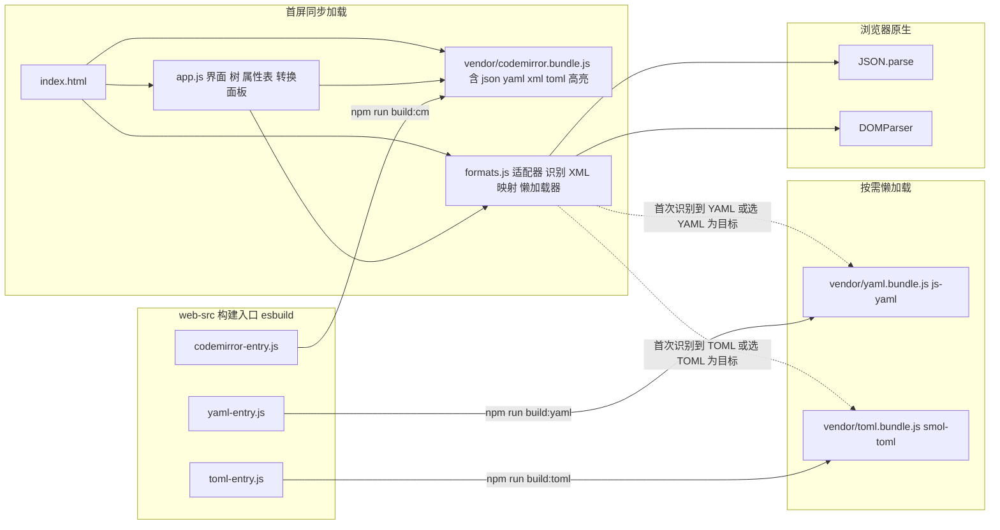
```mermaid
flowchart LR
    subgraph FIRST["首屏同步加载"]
        HTML["index.html"]
        CM["vendor/codemirror.bundle.js 含 json yaml xml toml 高亮"]
        FMT["formats.js 适配器 识别 XML 映射 懒加载器"]
        APP["app.js 界面 树 属性表 转换面板"]
    end
    subgraph LAZY["按需懒加载"]
        YB["vendor/yaml.bundle.js js-yaml"]
        TB["vendor/toml.bundle.js smol-toml"]
    end
    subgraph NATIVE["浏览器原生"]
        JP["JSON.parse"]
        DP["DOMParser"]
    end
    subgraph SRC["web-src 构建入口 esbuild"]
        S1["codemirror-entry.js"]
        S2["yaml-entry.js"]
        S3["toml-entry.js"]
    end
    HTML --> CM
    HTML --> FMT
    HTML --> APP
    APP --> FMT
    APP --> CM
    FMT --> JP
    FMT --> DP
    FMT -.->|"首次识别到 YAML 或选 YAML 为目标"| YB
    FMT -.->|"首次识别到 TOML 或选 TOML 为目标"| TB
    S1 -->|"npm run build:cm"| CM
    S2 -->|"npm run build:yaml"| YB
    S3 -->|"npm run build:toml"| TB
```

### 11. 统一数据模型

#### 11.1 模型定义

四种格式解析后都产出同一种「模型值」，即现有 `makeNode` / `childrenOf` 已经在消费的 JS 值：

| 模型类型 | JS 表示 | 树节点 type | 图标 |
| --- | --- | --- | --- |
| 对象 | 普通对象（键序为插入序） | object | object.gif |
| 数组 | Array | array | array.gif |
| 字符串 | string | string | blue.gif |
| 数字 | number（含 Infinity / NaN）或 `BigNum(raw)` | number | green.gif |
| 布尔 | boolean | boolean | yellow.gif |
| 空 | null | null | red.gif |
| **日期时间（新增）** | `DateVal(raw, kind)` | date | 新增 date 图标 |

`DateVal` 与 `BigNum` 同构：保存原文 `raw`，`kind` 取 `datetime` / `datetime-local` / `date` / `time`，`toJSON()` 返回 `raw`。只有 TOML 会产生它。新增它的理由：没有它，TOML 的「格式化」（解析后重排）会把日期写成带引号的字符串，属于数据错误。

图标：复制 `green.gif` 改调色板得到 `web/assets/ico/purple.gif`，CSS 加 `.tn .ni.date`，保持现有圆点风格。

不新增其它叶子类型：YAML `!!binary` 保持为 base64 字符串，inf / nan 属于 number。节点模型 `makeNode` / `childrenOf` / `walk` 与虚拟滚动全部不变，懒创建特性自动继承。

#### 11.2 大整数与高精度数

| 格式 | 保护方式 | 状态 |
| --- | --- | --- |
| JSON | 现有 `parseJSON`，原样保留 | 现有 |
| YAML | 自定义隐式标量标签 `tag:jsonviewer,2026:bignum`，正则命中 16 位以上数字时返回 `BigNum`，否则返回 `NOT_RESOLVED`。**必须放在 `CORE_SCHEMA.tags` 之前**，且 tagName 不能与内置 int 同名 | 已验证：整数和高精度小数都原文保留，`42` 仍是 number，带引号的仍是字符串，dump 输出无显式标签前缀 |
| TOML | `parse(text, { integersAsBigInt: 'asNeeded' })`，边界处把 BigInt 转成 `BigNum` | 已验证。**不传该选项时，超过 53 位的整数会直接抛错** |
| XML | 值全是字符串，无需保护；开启类型推断时，16 位以上数字转 `BigNum` | 设计 |

注意两点：

- BigInt 不能留在模型里，`JSON.stringify` 遇到 BigInt 会抛 TypeError，现有 `stringifyJSON` 和「复制 Value」都会坏。
- TOML 高精度浮点（超过 17 位有效数字）会丢精度，smol-toml 没有对应选项，列为已知限制。

沿用现有快速路径思路：文本里没有 16 位以上连续数字时（`LONG_DIGITS.test`），YAML 用不带 BigNum 标签的 schema。

#### 11.3 YAML

| 特性 | 处理 | 依据 |
| --- | --- | --- |
| Schema | YAML 1.2 core：`yes` / `no` / `on` 是字符串，日期是字符串，`0o17` / `0xFF` 是数字，`1_000` 是字符串 | 实测 |
| 锚点与别名 | 展开为共享引用；树按路径各自建节点，显示正常；转换时按值展开 | 实测共享引用 |
| 合并键 `<<` | 默认启用 `mergeTag` | 实测 |
| 循环引用 | `a: &x {self: *x}` 会产出真循环对象。解析后做一次迭代式检测，发现即拒绝，文案「YAML 含递归别名（循环引用），无法展示」 | 实测会产生循环 |
| 别名炸弹 | js-yaml 因共享引用能加载成功，但展开全部、查找、转换时会指数膨胀。检测循环的同一趟遍历里按对象身份记忆化计算「展开后节点数」，超过 500 万即拒绝。只在文本含 `*` 别名时才运行 | 实测 bomb 可加载 |
| 限制参数 | `maxAliases: 10000`、`maxDepth: 1000`（默认 100，实测 150 层即报错） | 实测 |
| 多文档 | 统一用 `loadAll`：0 篇得空树（纯注释 YAML 不算错误），1 篇直接作根，N 篇时根为数组、根标签显示「YAML（N 个文档）」；尾部 `---` 产生的空文档剔除 | 实测 `load('')` 抛错、`loadAll` 返回 `[]` |
| 非字符串键 | 标量键转字符串（`1` → `"1"`，`true` → `"true"`，`~` → `"null"`）；复合键（序列或映射作键）报错并定位 | 实测 |
| 重复键 | 报错（比 `JSON.parse` 的后者覆盖更严格），保持库默认 | 实测 |
| 自定义标签 | `!Ref`、`!!binary`、`!!set` 在 core schema 下会抛错。用**空前缀** `''` 加 `matchByTagPrefix: true` 的标量 / 序列 / 映射三个兜底标签追加在末尾，降级为裸值；标签名进 warnings。前缀写 `'!'` 不行，接不住 `!!binary` | 已验证 |
| `__proto__` 键 | 作为自有属性落地，不污染原型，无需额外处理（TOML 同） | 已验证 |

load 与 dump 用两套 schema（都已验证）：

- load：`[bigTag, ...CORE_SCHEMA.tags, mergeTag, 兜底标量, 兜底序列, 兜底映射]`
- dump：`[bigTag, dateTag, ...DUMP_SCHEMA.tags]`。DUMP_SCHEMA 会给 `yes`、`'2001-12-14'` 这类字符串加引号，对 YAML 1.1 消费方更安全。`dateTag` 是只在 dump 侧存在的隐式标签，`resolve` 用日期正则匹配，这样 `DateVal` 输出为不带引号的 `1979-05-27`，而长得像日期的普通字符串输出带引号。

已知限制：JS 对象会把整数形式的键排到最前面（与现有 JSON 行为一致），所以 YAML 的 `2: b, 1: a, name: x` 显示顺序是 1、2、name。

#### 11.4 TOML

| 特性 | 处理 |
| --- | --- |
| 日期时间 | `TomlDate` 在边界转成 `DateVal`：`raw = toISOString()` 并去掉补出来的 `.000`；`kind` 由 `isDate()` / `isTime()` / `isLocal()` 判定。输出时再转回 `new TomlDate(raw)` |
| inf / nan | JS Infinity / NaN，type 为 number，树上显示 `Infinity` / `NaN` |
| 无 null | 解析不会产生；输出时见 §15 |
| 整数与浮点区分 | `1.0` 解析后就是 `1`，重新输出为 `1`。不全局开 `numbersAsFloat`（会把 42 写成 42.0）。列为表示层损失 |
| 归一化遍历 | 解析后一趟迭代遍历，原地把 BigInt → BigNum、TomlDate → DateVal |

#### 11.5 XML 与对象的映射约定

采用 `@attr` / `#text` 约定（与 fast-xml-parser、xml2js、Badgerfish 系主流一致）。前缀固定，不做成可配置，减少组合。

**XML → 对象**

| XML 构造 | 对象表示 | 说明 |
| --- | --- | --- |
| 文档 | `{ 根元素名: 根元素值 }` | 根名保留为唯一顶层键，可往返 |
| 无属性、无子元素的元素 | 字符串（文本内容） | |
| 空元素 `<a/>` 或 `<a></a>` | `""` | 两种写法不可区分 |
| 属性 | 键 `@名`，值为字符串，排在子元素之前 | |
| 有属性或子元素时的文本 | 键 `#text` | |
| 同名兄弟元素 | 数组，放在首次出现的位置 | 只出现一次时不是数组，这是无 schema 映射的固有歧义 |
| 混合内容 | 各段文本拼接进 `#text`，与子元素的相对顺序丢失 | 记入 warnings |
| 同名元素不连续（a, b, a） | 归并进同一数组，原顺序丢失 | 记入 warnings |
| 命名空间 | 前缀原样留在键名（`soap:Envelope`）；`xmlns:*` 当普通属性；不做解析 | 用 `nodeName` |
| CDATA | 并入文本，标记丢失 | |
| 注释、处理指令、DOCTYPE | 丢弃，存在时记入 warnings | |
| XML 声明 | 丢弃；输出时固定写 `<?xml version="1.0" encoding="UTF-8"?>` | |
| 文本空白 | 默认首尾 trim；纯空白文本节点忽略 | |
| `__proto__` 元素名 | 用 `Object.defineProperty` 写入 | 自己写的转换器要自己防原型污染 |

示例：

```xml
<book id="1" lang="zh">
  <title>三体</title>
  <author>刘慈欣</author>
  <tag>科幻</tag>
  <tag>长篇</tag>
  <stock/>
</book>
```

映射为：

```json
{
    "book": {
        "@id": "1",
        "@lang": "zh",
        "title": "三体",
        "author": "刘慈欣",
        "tag": ["科幻", "长篇"],
        "stock": ""
    }
}
```

**类型推断：默认关闭。** XML 值全是字符串，推断会毁掉 `007`、前导零编号、长 ID。作为 XML 解析选项 `inferTypes` 提供，开启后规则从严：只有严格匹配 JSON 数字语法的才转数字（16 位以上转 BigNum），`true` / `false` 转布尔，其余保持字符串。开关放在转换面板的选项里，切换后重新解析，树同步变化。

**对象 → XML**

| 情况 | 输出 |
| --- | --- |
| 根元素名 | 顶层是单键对象且该键值不是数组、键名合法时，用该键作根（与 XML → 对象对称，可往返）；否则包一层 `<root>`（名字可在选项里改） |
| 顶层数组 | `<root><item>…</item>…</root>` |
| 数组 | 以父键名重复的元素 |
| 数组里嵌数组 | 内层用 `<item>` 包裹 |
| 空数组 | 不输出，记损失 |
| `@` 开头的键且值为标量 | 属性 |
| `@` 开头的键但值为对象或数组 | 按普通元素处理（名字清洗），记损失 |
| `#text` | 文本内容 |
| null | `<a/>` |
| `""` | `<a></a>` |
| 数字、布尔、BigNum、DateVal | 文本（BigNum / DateVal 用 raw） |
| 非法标签名 | 按 XML 1.0 Name 规则（BMP 子集，允许至多一个冒号）校验；非法字符替换为 `_`，首字符非法时前面补 `_`，空键写成 `_`；记损失并举例（`first name` → `first_name`）。中文键名合法，原样保留 |
| XML 1.0 不允许的控制字符 | 替换为 U+FFFD，记损失 |
| 转义 | 文本转义 `& < >`；属性值转义 `& < "` 及换行制表符 |

实现要求：DOM → 对象的转换用显式栈迭代实现，或加 1000 层深度上限，避免深层 XML 栈溢出。

### 12. 格式适配器抽象

#### 12.1 接口

放在新文件 `web/js/formats.js`，暴露 `window.JV`。四个适配器是普通对象，注册在 `JV.FORMATS = { json, yaml, toml, xml }`。

| 成员 | 签名 | 说明 |
| --- | --- | --- |
| `id` / `label` / `ext` / `mime` | 字符串 | 如 `yaml` / `YAML` / `yaml` / `application/yaml`；label 也用作根节点文字 |
| `vendor` | 字符串或 null | 懒加载包名；json 与 xml 为 null |
| `caps` | 对象 | 能力声明，见下表 |
| `sniff(sample)` | 返回整数 | 识别用的信号计数，只看文本头部 |
| `ensureLoaded()` | 返回 Promise | vendor 为 null 时返回已完成的 Promise |
| `language()` | 返回 CodeMirror 扩展 | `CM.json()` / `CM.yaml()` / `CM.StreamLanguage.define(CM.toml)` / `CM.xml()` |
| `parse(text, opts)` | 返回 `{ value, warnings[], docCount }`，失败抛 `FormatError` | 同步；调用前必须已加载 |
| `stringify(value, opts)` | 返回 `{ text, losses[] }`，失败抛 `FormatError` | 不得修改传入的模型 |
| `format(text, opts)` / `minify(text)` | 返回字符串 | 文本工具，caps 声明不支持时不存在 |

`parse` 返回对象而不是裸值，是承载「标签被丢弃、多文档、混合内容」这类非致命信息的唯一通道。

`FormatError` 字段：`format`、`message`（库原文）、`offset`（绝对偏移，未知为 -1）。行列号统一由 `edit.lineCol(offset)` 计算，不信任各库自带的行列（基数不一致）。

`losses` / `warnings` 条目：`{ code, count, paths[], sample }`，paths 最多保留 5 条，形如 `$.a.b[3]`。

能力声明：

| caps 字段 | json | yaml | toml | xml |
| --- | --- | --- | --- | --- |
| `format`（格式化） | 是（字符扫描，容错） | 是（解析后重排） | 是（解析后重排） | 是（DOM 重排，保留注释与 CDATA） |
| `minify`（删除空格） | 是 | 否 | 否 | 是（DOM 去除元素间空白） |
| `escape`（转义与去除转义） | 是 | 否 | 否 | 否 |
| `topLevel` | any | any | object | 单根元素 |
| `nulls` | 是 | 是 | 否 | 近似（空元素） |
| `comments`（源里可能有注释） | 否 | 是 | 是 | 是 |

选项：`parse` 的 opts 只有 `{ inferTypes }`（仅 XML）；`stringify` 的 opts 为 `{ indent, xmlRoot, xmlItem }`。

`JV` 上的其它导出：`BigNum`、`DateVal`、`parseJSON`、`stringifyJSON`、`findJsonError`（后三者从 `app.js` 原样搬入，逻辑不改）、`detect(text)`、`loadVendor(name)`、`convert(model, targetId, opts)`。

下图为适配器接口、四个实现以及与编辑器、树、转换面板的关系。

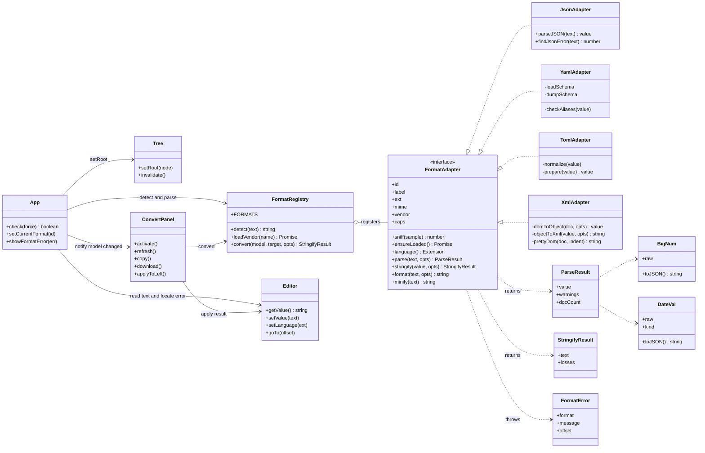
```mermaid
classDiagram
    direction LR
    class FormatAdapter {
        <<interface>>
        +id
        +label
        +ext
        +mime
        +vendor
        +caps
        +sniff(sample) number
        +ensureLoaded() Promise
        +language() Extension
        +parse(text, opts) ParseResult
        +stringify(value, opts) StringifyResult
        +format(text, opts) string
        +minify(text) string
    }
    class JsonAdapter {
        +parseJSON(text) value
        +findJsonError(text) number
    }
    class YamlAdapter {
        -loadSchema
        -dumpSchema
        -checkAliases(value)
    }
    class TomlAdapter {
        -normalize(value)
        -prepare(value) value
    }
    class XmlAdapter {
        -domToObject(doc, opts) value
        -objectToXml(value, opts) string
        -prettyDom(doc, indent) string
    }
    class FormatRegistry {
        +FORMATS
        +detect(text) string
        +loadVendor(name) Promise
        +convert(model, target, opts) StringifyResult
    }
    class ParseResult {
        +value
        +warnings
        +docCount
    }
    class StringifyResult {
        +text
        +losses
    }
    class FormatError {
        +format
        +message
        +offset
    }
    class BigNum {
        +raw
        +toJSON() string
    }
    class DateVal {
        +raw
        +kind
        +toJSON() string
    }
    class App {
        +check(force) boolean
        +setCurrentFormat(id)
        +showFormatError(err)
    }
    class Editor {
        +getValue() string
        +setValue(text)
        +setLanguage(ext)
        +goTo(offset)
    }
    class Tree {
        +setRoot(node)
        +invalidate()
    }
    class ConvertPanel {
        +activate()
        +refresh()
        +copy()
        +download()
        +applyToLeft()
    }
    FormatAdapter <|.. JsonAdapter
    FormatAdapter <|.. YamlAdapter
    FormatAdapter <|.. TomlAdapter
    FormatAdapter <|.. XmlAdapter
    FormatRegistry o-- FormatAdapter : registers
    FormatAdapter ..> ParseResult : returns
    FormatAdapter ..> StringifyResult : returns
    FormatAdapter ..> FormatError : throws
    ParseResult ..> BigNum
    ParseResult ..> DateVal
    App --> FormatRegistry : detect and parse
    App --> Editor : read text and locate error
    App --> Tree : setRoot
    App --> ConvertPanel : notify model changed
    ConvertPanel --> FormatRegistry : convert
    ConvertPanel --> Editor : apply result
```

#### 12.2 与 check() 的衔接

`check(force)` 的新流程：

1. 取文本；文本与格式模式都没变则直接返回（现有短路加上模式判断）；空文本短路不变。
2. `fmt = 手动模式 ? 手动值 : JV.detect(text)`。
3. 格式变化时调 `setCurrentFormat(fmt)`：切换语言 Compartment、更新工具栏可用性、更新格式徽标。
4. 适配器未加载时：树区显示「正在加载 YAML 解析器…」，`ensureLoaded().then(() => check(true))`，本次返回 `null`。
5. `adapter.parse(text, opts)`；失败走统一的 `showFormatError`。
6. 成功：`makeNode(adapter.label, value, null)` → `tree.setRoot` → `grid.show` → `search.reset` → `saveText`；通知转换面板数据已变。

`check()` 对 JSON 和 XML，以及库已加载的 YAML / TOML，仍然同步返回 true / false；只有首次懒加载那一次返回 `null`。

下图为「粘贴 YAML 后识别、懒加载、解析、建树」以及「转换为 TOML 并应用到左侧」的完整时序。

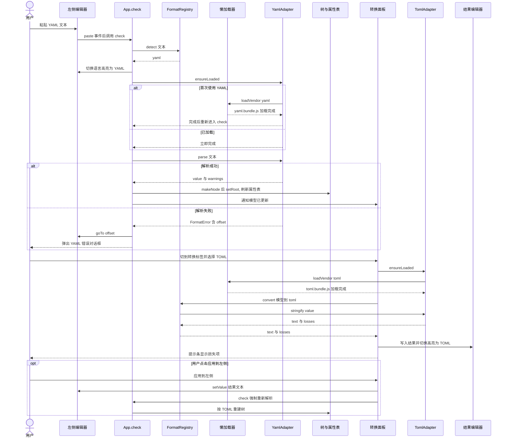
```mermaid
sequenceDiagram
    actor U as 用户
    participant E as 左侧编辑器
    participant A as App.check
    participant R as FormatRegistry
    participant L as 懒加载器
    participant Y as YamlAdapter
    participant T as 树与属性表
    participant C as 转换面板
    participant TA as TomlAdapter
    participant RE as 结果编辑器

    U->>E: 粘贴 YAML 文本
    E->>A: paste 事件后调用 check
    A->>R: detect 文本
    R-->>A: yaml
    A->>E: 切换语言高亮为 YAML
    A->>Y: ensureLoaded
    alt 首次使用 YAML
        Y->>L: loadVendor yaml
        L-->>Y: yaml.bundle.js 加载完成
        Y-->>A: 完成后重新进入 check
    else 已加载
        Y-->>A: 立即完成
    end
    A->>Y: parse 文本
    alt 解析成功
        Y-->>A: value 与 warnings
        A->>T: makeNode 后 setRoot, 刷新属性表
        A->>C: 通知模型已更新
    else 解析失败
        Y-->>A: FormatError 含 offset
        A->>E: goTo offset
        A-->>U: 弹出 YAML 错误对话框
    end

    U->>C: 切到转换标签并选择 TOML
    C->>TA: ensureLoaded
    TA->>L: loadVendor toml
    L-->>TA: toml.bundle.js 加载完成
    C->>R: convert 模型到 toml
    R->>TA: stringify value
    TA-->>R: text 与 losses
    R-->>C: text 与 losses
    C->>RE: 写入结果并切换高亮为 TOML
    C-->>U: 提示条显示损失项
    opt 用户点击应用到左侧
        U->>C: 应用到左侧
        C->>E: setValue 结果文本
        C->>A: check 强制重新解析
        A->>T: 按 TOML 重建树
    end
```

#### 12.3 需要改动的清单

`web/js/app.js`：

| 位置 | 改动 |
| --- | --- |
| `BigNum` / `parseJSON` / `findJsonError` / `stringifyJSON` | 原样搬到 `formats.js`，`app.js` 改为引用 `JV.*` |
| `typeOf` | 增加 `DateVal` → `date` |
| `valueText` / `rawValueText` | 增加 date 分支 |
| `nodeText`（写死的 `'JSON'`） | 改为当前适配器的 label |
| `tree.render` 空提示文案 | 改为通用文案 |
| `grid.show` 与 `ctxMenu.act` 里写死的 `'JSON'` | 同上 |
| 编辑器创建 | `CM.json()` 换成语言 Compartment；placeholder 文案改为四种格式 |
| `edit` | 增加 `setLanguage(ext)` |
| `check` | 按 §12.2 重写；错误对话框标题用格式名 |
| `saveText` 与 `init` | 同时存取格式模式（`jsonviewer_fmt:<用户>`） |
| 工具栏按钮 | 按 caps 路由，并维护 disabled 状态 |
| 关于对话框 | 更新文案 |
| `window.jsonviewer` | 增加 `setFormat` / `getFormat` / `convert` / `whenIdle` |
| 新增 | 格式下拉、中栏标签页切换、转换面板控制器（第二个只读 EditorView，首次切到转换标签时才创建）、下载、忙碌提示 |

其它文件：

| 文件 | 改动 |
| --- | --- |
| `web/index.html` | 左栏标题行加格式下拉；中栏标题行加标签；转换工具栏、损失提示条、结果编辑器容器；`<script src="js/formats.js">` 放在 `app.js` 之前 |
| `web/css/style.css` | 标签页、格式下拉、转换面板、`.ni.date`、按钮禁用态 |
| `web-src/codemirror-entry.js` | 增加 `yaml`、`xml`、`StreamLanguage`、`toml` 导出 |
| `web-src/yaml-entry.js`、`web-src/toml-entry.js` | 新增 |
| `package.json` | 新增依赖（js-yaml 与 smol-toml 写精确版本）和 `build:yaml` / `build:toml` / `build:vendor` / `test:formats` 脚本 |
| `tests/e2e.js`、`tests/formats.js` | 扩充 / 新增 |
| `.github/workflows/ci.yml` | smoke test 增加对新文件的请求，增加 formats 测试步骤 |
| `README.md`、`README_CN.md`、`CLAUDE.md` | 同步 |

### 13. 格式识别

#### 13.1 优先级

手动指定永远优先于自动识别，且手动模式下不做任何回退。左栏标题行的下拉显示「自动 · YAML」这样的徽标，用户随时能看到当前按什么格式解析。

#### 13.2 自动识别判定顺序

1. 去掉 BOM 和前导空白，取首个字符。
2. 首字符是 `<`：XML。
3. 首字符是 `{`：JSON，失败就报 JSON 错误，**不回退 YAML**。
4. 首字符是 `[`：取首行（不超过 256 字符）。如果整行匹配 TOML 表头（`[a.b]` 或 `[[a]]`，裸键），且键不是纯数字、`true`、`false`、`null`，判为 TOML；否则 JSON。
5. 以 `---`、`%YAML`、`%TAG` 开头：YAML。
6. 其余：扫描前 8 KB 内最多 50 个有效行（非空、非 `#` 注释），逐行计信号。
   - TOML 信号：整行是表头，或行内 `=` 出现在「冒号加空白」之前。
   - YAML 信号：以 `- ` 开头，或「冒号加空白或行尾」出现在 `=` 之前。
   - TOML 信号多于 YAML 信号：TOML；YAML 信号大于 0：YAML。
7. 两边信号都为 0：试 `JSON.parse`（覆盖 `123`、`"abc"`、`true`、`null` 这类 JSON 标量），成功判 JSON，失败判 YAML。

这套顺序由三个实测事实决定：

- 坏 JSON `{"a": 1, "b": [1, 2,]}` 会被 YAML 宽容地解析成功。如果 JSON 失败后回退 YAML，用户看不到错误，也会破坏现有「错误对话框含行列定位」的测试。
- `name = "x"` 加 `version = "1"` 两行会被 YAML **成功**解析成一个多行字符串标量。所以 TOML 判定必须在 YAML 之前，且没有 `[section]` 也要能判为 TOML。
- `[package]` 以 `[` 开头，与 JSON 数组冲突，所以需要第 4 步的表头例外。

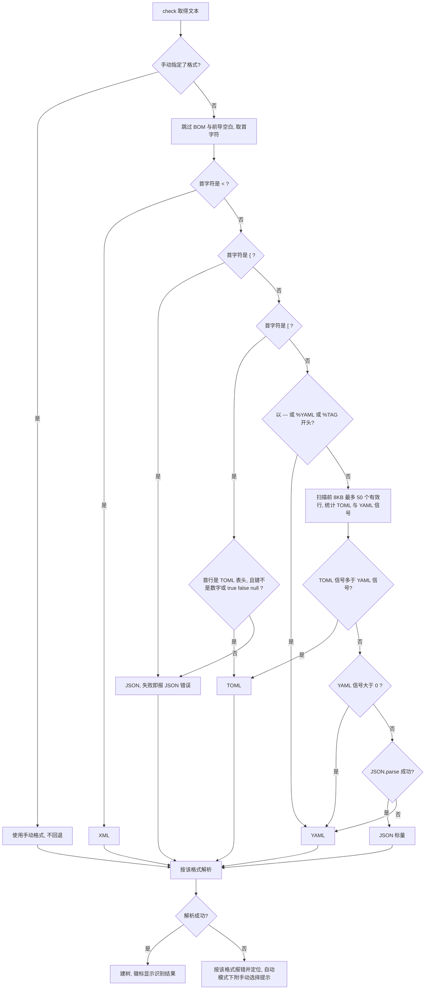
```mermaid
flowchart TD
    A["check 取得文本"] --> B{"手动指定了格式?"}
    B -->|是| M["使用手动格式, 不回退"]
    B -->|否| C["跳过 BOM 与前导空白, 取首字符"]
    C --> D{"首字符是 < ?"}
    D -->|是| XML["XML"]
    D -->|否| E{"首字符是 { ?"}
    E -->|是| JSON["JSON, 失败即报 JSON 错误"]
    E -->|否| F{"首字符是 [ ?"}
    F -->|是| G{"首行是 TOML 表头, 且键不是数字或 true false null ?"}
    G -->|是| TOML["TOML"]
    G -->|否| JSON
    F -->|否| H{"以 --- 或 %YAML 或 %TAG 开头?"}
    H -->|是| YAML["YAML"]
    H -->|否| I["扫描前 8KB 最多 50 个有效行, 统计 TOML 与 YAML 信号"]
    I --> J{"TOML 信号多于 YAML 信号?"}
    J -->|是| TOML
    J -->|否| K{"YAML 信号大于 0 ?"}
    K -->|是| YAML
    K -->|否| L{"JSON.parse 成功?"}
    L -->|是| JSON2["JSON 标量"]
    L -->|否| YAML
    M --> P["按该格式解析"]
    XML --> P
    JSON --> P
    JSON2 --> P
    TOML --> P
    YAML --> P
    P --> Q{"解析成功?"}
    Q -->|是| R["建树, 徽标显示识别结果"]
    Q -->|否| S["按该格式报错并定位, 自动模式下附手动选择提示"]
```

#### 13.3 误判处理

- 不做级联重试：识别为某格式后解析失败，就按该格式报错，不再试别的格式。
- 自动模式下的错误对话框多一行提示：「当前按 YAML 解析（自动识别）。如格式不对，请在左上角手动选择。」JSON 错误且首字符为 `{` 或 `[` 时提示：「如果这是 YAML 流式写法，请手动选择 YAML。」
- YAML 兜底检查：输入有多行，解析结果却是顶层字符串标量时，照常建树，但 toast 提示「解析结果是单个字符串，可能不是 YAML」。
- 手动模式随文本一起存入 sessionStorage，刷新不丢。

JSON 路径的额外开销：跳过前导空白加一次首字符比较。

### 14. 转换界面设计

#### 14.1 方案比选

- **方案 A**：左栏加「格式」下拉和「转换为」按钮，直接替换编辑器内容。
- **方案 B**：左栏用格式标签页，切换标签即转换。
- **方案 C**：中栏加标签页「树视图 | 转换」，转换结果为只读编辑器，带目标格式切换、复制、下载、应用到左侧。

| 维度 | A 左栏替换 | B 左栏标签页 | C 中栏转换标签页 |
| --- | --- | --- | --- |
| 是否破坏源文本 | 是，直接覆盖（只能靠 Ctrl+Z） | 是，且切换动作看起来不像破坏性操作 | 否；只有点「应用到左侧」才覆盖 |
| 有损转换的提示 | 只能弹窗或 toast，一闪而过；先确认再转换会打断操作 | 同 A，且每次切标签都可能弹 | 结果上方常驻提示条，可展开详情，不打断 |
| 源与结果对照 | 不能 | 不能 | 能，左源右结果并排 |
| 三栏布局兼容 | 好 | 好 | 好；三栏不变，中栏内部切换 |
| 与左栏工具栏的关系 | 左栏 440px 已放 5 个按钮，再加两个控件会折行 | 标签占一行，工具栏按钮含义随标签变化 | 左工具栏不增按钮；转换操作都在中栏自己的工具栏 |
| 语义清晰度 | 「格式」和「转换为」两个控件容易混 | 「声明格式」和「转换格式」是同一个动作，歧义最大 | 左边管「这是什么格式」，中间管「转成什么格式」 |
| 多次试不同目标 | 每次都改写源，损失累积 | 同 A | 源不动，随便切目标，损失不累积 |
| 大文本内存 | 一份文本 | 一份文本 | 两份文本（第二个编辑器按需创建） |
| 实现复杂度 | 低（约 0.5 天） | 中（约 1 天，要处理标签与识别的同步） | 中高（约 2 天：标签切换、第二个 EditorView、提示条、下载） |

**推荐方案 C。** 决定性的理由是损失不累积且可见：A 和 B 每转一次就把有损结果写回源，注释、锚点、类型一次次丢，用户没有机会对照。C 多出的约 1.5 天工作量主要是界面代码，数据层三个方案完全相同。

无论哪个方案，左栏都需要一个格式下拉（手动指定源格式），这部分不属于方案差异。

#### 14.2 推荐方案线框

树视图标签（默认；与现在相比只多了左栏的格式下拉和中栏的标签）：

```text
+-------------------------------------------+ +---------------------------------------------------------+ +----------------+
| YAML数据              格式: [自动 · YAML v] | | 视图  [树视图] [转换]                          [admin v] | | 属性           |
+-------------------------------------------+ +---------------------------------------------------------+ +----------------+
| [复制][格式化][删除空格][删除空格并转义][去除转义] | | 查找:[______][GO!] [下一个][上一个] | [全部展开][全部收缩] [关于] | | 名称   | 值    |
+-------------------------------------------+ +---------------------------------------------------------+ +--------+-------+
|  1 | server:                              | | - YAML                                                  | | host   | "a"   |
|  2 |   host: a                            | |   - server                                              | | port   | 80    |
|  3 |   port: 80                           | |       host : "a"                                        | |        |       |
|  4 | # comment                            | |       port : 80                                         | |        |       |
+-------------------------------------------+ +---------------------------------------------------------+ +----------------+
```

转换标签（中栏工具栏和主体被替换，左右两栏不变）：

```text
+-------------------------------------------+ +---------------------------------------------------------+ +----------------+
| YAML数据              格式: [自动 · YAML v] | | 视图  [树视图] [转换]                          [admin v] | | 属性           |
+-------------------------------------------+ +---------------------------------------------------------+ +----------------+
| [复制][格式化][删除空格][删除空格并转义][去除转义] | | 转换为: (JSON)(YAML)(TOML)(XML) | [复制][下载][应用到左侧] [选项 v] | | 名称   | 值    |
+-------------------------------------------+ +---------------------------------------------------------+ +--------+-------+
|  1 | server:                              | | ! 有损转换: 注释不保留; 1 个 null 已丢弃 ($.a.b)   [详情] | | host   | "a"   |
|  2 |   host: a                            | +---------------------------------------------------------+ | port   | 80    |
|  3 |   port: 80                           | |  1 | [server]                                           | |        |       |
|  4 | # comment                            | |  2 | host = "a"                                         | |        |       |
|    |                                      | |  3 | port = 80                                          | |        |       |
+-------------------------------------------+ +---------------------------------------------------------+ +----------------+
```

#### 14.3 交互说明

| 元素 | 行为 |
| --- | --- |
| 格式下拉（左栏标题行右侧） | 自动 / JSON / YAML / TOML / XML。自动模式显示识别结果。改动后立即重新解析。放在标题行而不是工具栏，是因为左工具栏的 5 个按钮在 440px 宽度下已经放满 |
| 左栏标题 | 随当前格式显示「JSON数据」「YAML数据」等；JSON 时与现在完全一致 |
| 中栏标签 | 放在「视图」标题右侧，用户菜单仍靠右 |
| 目标格式 | 四选一分段按钮。源不是 JSON 时默认 JSON，源是 JSON 时默认 YAML。允许与源同格式（相当于规范化预览） |
| 惰性计算 | 停在树视图标签时不做任何转换，不转换的用户零开销。切到转换标签、切换目标、改选项、源重新解析成功时才计算；结果按（解析序号、目标、选项）缓存 |
| 源解析失败时 | 转换面板显示「左侧文本解析失败，请先修正」和「定位错误」按钮，结果区清空 |
| 提示条 | 分两级。固有损失（由源和目标格式决定，如「注释不保留」）用灰色文字；实际损失（与数据有关，如丢了几个 null、改写了几个键名）用警告色并附数量和路径。无损时不显示。点「详情」弹对话框列出最多 50 条 |
| 复制 | 复制结果全文 |
| 下载 | Blob 加 `a[download]`，文件名 `converted.<ext>`，不经服务端 |
| 应用到左侧 | 用单次 CodeMirror 事务替换左侧文本（可 Ctrl+Z 撤销）；格式模式原来是自动则保持自动，原来是手动则切到目标格式；重新解析后切回树视图标签，toast「已应用，Ctrl+Z 可撤销」 |
| 选项 | 缩进；目标为 XML 时的根元素名；源为 XML 时的「推断类型」。存 localStorage |
| 右栏属性表 | 在转换标签下保持最后选中节点的内容，不受影响 |

实现注意：树的 `render()` 依赖 `body.clientHeight`，从转换标签切回时必须调用 `tree.invalidate()`，否则行区间会算成空。

中栏与转换面板的状态迁移如下。

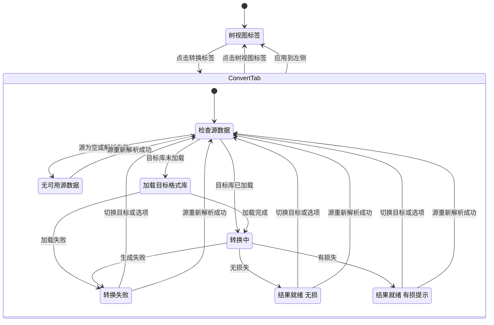
```mermaid
stateDiagram-v2
    [*] --> TreeTab
    state "树视图标签" as TreeTab
    state ConvertTab {
        [*] --> Checking
        state "检查源数据" as Checking
        state "无可用源数据" as NoSource
        state "加载目标格式库" as LoadingLib
        state "转换中" as Converting
        state "结果就绪 无损" as Ready
        state "结果就绪 有损提示" as ReadyLossy
        state "转换失败" as Failed
        Checking --> NoSource : 源为空或解析失败
        Checking --> LoadingLib : 目标库未加载
        Checking --> Converting : 目标库已加载
        LoadingLib --> Converting : 加载完成
        LoadingLib --> Failed : 加载失败
        Converting --> Ready : 无损失
        Converting --> ReadyLossy : 有损失
        Converting --> Failed : 生成失败
        Ready --> Checking : 切换目标或选项
        ReadyLossy --> Checking : 切换目标或选项
        Failed --> Checking : 切换目标或选项
        Ready --> Checking : 源重新解析成功
        ReadyLossy --> Checking : 源重新解析成功
        NoSource --> Checking : 源重新解析成功
        Failed --> Checking : 源重新解析成功
    }
    TreeTab --> ConvertTab : 点击转换标签
    ConvertTab --> TreeTab : 点击树视图标签
    ConvertTab --> TreeTab : 应用到左侧
```

#### 14.4 左栏工具栏按钮可用性矩阵

| 按钮 | JSON | YAML | TOML | XML |
| --- | --- | --- | --- | --- |
| 复制 | 可用 | 可用 | 可用 | 可用 |
| 格式化 | 可用。现有字符扫描算法，对非法 JSON 也能工作 | 可用。解析后重排，注释、锚点、书写风格不保留；toast 提示并可撤销 | 可用。同 YAML | 可用。DOM 重排缩进，保留注释、CDATA、处理指令 |
| 删除空格 | 可用 | 禁用（缩进有语义） | 禁用（换行有语义） | 可用。去除元素间的纯空白文本 |
| 删除空格并转义 | 可用 | 禁用 | 禁用 | 禁用 |
| 去除转义 | 可用 | 禁用 | 禁用 | 禁用 |

禁用的按钮置灰，`title` 说明原因。编辑器为空且模式为自动时，按 JSON 处理。YAML / TOML / XML 的格式化需要先解析成功，失败则走错误定位。

### 15. 转换矩阵与信息损失

#### 15.1 4×4 矩阵

行是源，列是目标。全部 16 格都可行，没有必然失败的格；失败只发生在源解析失败或含循环引用时。

| 源 \ 目标 | JSON | YAML | TOML | XML |
| --- | --- | --- | --- | --- |
| **JSON** | 规范化重排 | 无损 | 丢 null；顶层非对象要包装；非整数 BigNum 丢精度；键序调整 | 类型变文本；空数组丢失；单元素数组不可区分；非法键名改写；可能加 `<root>` |
| **YAML** | 丢注释、锚点、标签、书写风格；多文档变数组；inf / nan 变 null；非字符串键变字符串 | 规范化（丢注释、锚点改为展开、风格） | YAML → JSON 的损失（inf / nan 除外，可保留）加 JSON → TOML 的损失 | YAML → JSON 的损失加 JSON → XML 的损失 |
| **TOML** | 丢注释；日期变字符串；inf / nan 变 null；整数浮点区分；表的书写风格 | 丢注释；日期输出为不带引号的标量（YAML 1.2 下是字符串）；inf / nan 保留 | 规范化（丢注释；`1.0` 变 `1`；时间补 `.000`；表的书写风格） | 丢注释；全部变文本 |
| **XML** | 丢注释、处理指令、DOCTYPE、CDATA 标记；混合内容与不连续同名元素的顺序；单个与数组的歧义；值全是字符串 | 同左 | 同左；根对象天然是表，适配良好 | 规范化（丢注释等；「格式化」按钮走 DOM，能保留注释） |

各目标的输出规则：

- **目标 JSON**：inf / nan 写成 `null`（原生行为）并记损失；DateVal 写成字符串；BigNum 原文输出。
- **目标 YAML**：多文档来源且目标也是 YAML 时用 `---` 分隔输出；别名按值展开（`noRefs: true`）。
- **目标 TOML**：
  - 对象里值为 null 的键丢弃并记损失（smol-toml 对顶层 null 键静默丢弃）。
  - 数组里的 null 元素丢弃并记损失，文案注明后续下标前移。smol-toml 遇到数组里的 null 会直接崩溃（实测报 `Cannot read properties of null`），所以必须预处理。
  - 顶层数组包装成 `items = [...]`，顶层标量包装成 `value = ...`，记损失。smol-toml 对顶层非对象会抛错。
  - 预处理遍历采用结构共享：子树不需要改动时直接复用原对象，不复制，不修改模型。
- **目标 XML**：见 §11.5。

#### 15.2 提示文案原则

1. 说清是哪一侧出问题：源解析失败，还是目标生成失败。
2. 任何与数据有关的损失都必须进提示条，不允许静默丢数据。
3. 用动词说明做了什么：「已丢弃」「已改写」「已转为字符串」「已包装到 items 键下」。
4. 给数量和路径（`$.a.b[3]` 形式），最多列 5 条，其余折叠进「详情」。
5. 库的英文原始错误放在 `<pre>` 里，中文总述在前，与现有 JSON 错误对话框一致。
6. 能通过选项改变的行为，文案里指明选项名。

#### 15.3 转换选项

只提供三项，其余固定：

| 选项 | 默认 | 说明 |
| --- | --- | --- |
| 缩进 | JSON 4、YAML 2、XML 4 | TOML 无缩进概念 |
| XML 根元素名 | `root` | 仅在需要包装时使用；数组项名固定为 `item` |
| XML 推断类型 | 关 | 仅源为 XML 时显示 |

属性前缀 `@` 和文本键 `#text` 固定，不做成选项。

### 16. 性能

#### 16.1 实测速率

本机 headless Chrome，每项单独开页面测 3 次。

| 操作 | 速率（约） | 20 MB 预估 | 50 MB 预估 |
| --- | --- | --- | --- |
| JSON.parse | 5 ms/MB | 0.1 s | 0.25 s |
| js-yaml load | 60 ms/MB | 1.2 s | 3 s |
| js-yaml dump | 100 ms/MB | 2 s | 5 s |
| smol-toml parse | 45 ms/MB | 0.9 s | 2.3 s |
| smol-toml stringify | 30 ms/MB | 0.6 s | 1.5 s |
| DOMParser + 转对象 | 105 ms/MB | 2.1 s | 5.3 s |
| 手写 XML 序列化 | 未实测，估 30–40 ms/MB | | |

未实测项：手写 XML 序列化器的速度；CodeMirror 对几十 MB 的 YAML / XML 的高亮表现（lezer 是增量、按视口解析，预期与 JSON 相当，需在收尾阶段验证）；数据形态不同（如大量块标量的 YAML）时速率会有出入。

#### 16.2 结论

- **不做 Web Worker。** 理由：Worker 里没有 DOMParser，XML 进不去（除非为此引入 fast-xml-parser）；对象图回主线程要结构化克隆，代价与解析同量级，且 `BigNum` / `DateVal` 会丢原型需要重建；JSON 路径现在也不在 Worker 里。等真有大 YAML 卡顿的反馈再议。
- **体积阈值**：非 JSON 源文本或转换输入超过 20 MB 时弹确认框，按上表速率给出预计耗时（「文本约 32 MB，按 YAML 解析预计需要 2 秒，期间页面无响应，是否继续？」）。不设硬上限。JSON 源的解析不受此限制，与现在一致。
- **忙碌提示**：预计耗时超过 300 ms 时，先显示「正在解析…」或「正在转换…」，等两帧 `requestAnimationFrame` 让浏览器绘制后再开始阻塞计算。
- **内存**：DOMParser 解析大 XML 会临时占用数倍于文本的内存，转换完成后立即释放 DOM 引用。转换结果编辑器持有第二份文本，受同一阈值约束。
- **懒加载**：见 §10.3。加载器按包名缓存 Promise；`<script>` 用相对路径（兼容 `base_path`）。加载失败时先 `fetch('api/me')`：401 跳登录页，否则 toast「加载 YAML 解析器失败，请刷新重试」。
- **别名炸弹与循环检查**只在 YAML 文本含 `*` 时运行；BigNum 标签只在文本含 16 位以上数字时启用。

#### 16.3 JSON 路径零退化

- 识别只多一次首字符判断，`{` 或 `[` 开头直接进现有 `parseJSON`。
- 不加载任何 vendor 懒加载包；第二个 EditorView 不创建；转换不计算。
- 树、属性表、查找代码路径不变（`typeOf` 多一次 `instanceof` 判断，只在 object 分支上）。
- 唯一的固定成本是 CodeMirror 包多 36 KB、`formats.js` 约 30 KB。
- 验收：现有 e2e 性能断言阈值全部不变并通过；新增断言「纯 JSON 会话的网络请求里没有 `yaml.bundle.js` / `toml.bundle.js`」。

### 17. 错误定位

各适配器把库错误统一成 `FormatError { format, message, offset }`，`check()` 统一做 `edit.goTo(offset)` 和行列显示。

| 格式 | 库给的位置信息 | 映射方式 |
| --- | --- | --- |
| JSON | 现有逻辑 | `findJsonError(text)`，失败再用 `edit.errorOffset(msg)`，不变 |
| YAML | `YAMLException.mark.position`（0 基绝对偏移）；`mark.line` / `mark.column` 也是 0 基，而 message 文本里的是 1 基 | 直接用 `position`；显示用 `reason`（不带代码片段的短消息）。非 YAMLException 的异常不定位 |
| TOML | `TomlError.line` / `.column`，都是 1 基（实测） | `doc.line(line).from + column - 1`；显示取 `message` 的第一行（后面是库自带的代码片段） |
| XML | 不抛异常，文档里出现 `parsererror` 元素 | 见下 |

XML 的细节：

- 检测 parsererror：启动时解析一次 `'<'` 得到本浏览器 parsererror 元素的 namespaceURI，之后用 `getElementsByTagNameNS(该命名空间, 'parsererror')` 判断。这样用户文档里恰好有名为 `parsererror` 的元素也不会误判。
- 位置提取用两条正则：Chrome / Safari 的 `error on line N at column M: 消息`（实测），Firefox 的 `Line Number N, Column M`（未实测，按已知格式）。都不匹配时只弹错误文案，不定位。
- 列号是近似值：实测 `<b>1</c>` 报的列在错误标签之后；Chrome 的列可能按 UTF-8 字节计，含中文的行会偏大。处理：换算后钳制到该行行尾，对话框写「位置（近似）」。

自有检查产生的错误：循环引用、别名展开超限不定位；复合键由 js-yaml 报错并带位置。

### 18. 测试计划

#### 18.1 表驱动格式测试（新增 `tests/formats.js`）

因为 XML 依赖 DOMParser，这些测试在 headless Chrome 页面里通过 `window.jsonviewer.convert(text, from, to, opts)` 运行，不涉及界面，不启动登录实例。新增 `npm run test:formats`，CI 加一步。

| 分组 | 用例 |
| --- | --- |
| YAML 解析 | 大整数与高精度小数保留原文；带引号的长数字仍是字符串；`yes` / `no` 是字符串；日期是字符串；合并键；别名共享；循环引用被拒绝；别名炸弹被拒绝；多文档得数组；纯注释文档得空树；`!Ref` / `!!binary` / `!!set` 降级并产生 warning；复合键报错带位置；重复键报错；150 层嵌套可解析 |
| TOML 解析 | 大于 53 位的整数保留原文；四种日期类型的 kind 与 raw；inf / nan；表数组；点分键；内联表 |
| XML 解析 | 属性、文本、`#text` 与属性并存、重复元素成数组、单个元素不成数组、空元素得空串、混合内容产生 warning、不连续同名元素产生 warning、命名空间前缀保留、CDATA 并入文本、注释 / 处理指令 / DOCTYPE 丢弃并 warning、实体解码、`__proto__` 元素名安全、类型推断开关（`007` 保持字符串、长数字成 BigNum） |
| 往返 | JSON → YAML → JSON 完全相等（含大数、Unicode、空容器、特殊字符串 `"yes"`、`"123"`、`"x: y"`、多行字符串）；JSON → TOML → JSON（不含 null 的对象）相等；TOML → YAML → TOML 日期保持不带引号；XML → JSON → XML 结构相等（无注释、无混合内容的文档）；对象 → XML → 对象（单键根）相等；四种格式各自 X → X 规范化幂等 |
| 损失：→ TOML | null 键被丢并计数；数组内 null；顶层数组包装到 `items`；顶层标量包装到 `value` |
| 损失：→ XML | 非法键名改写规则逐条；中文键名保留；`@` 键成属性；空数组；嵌套数组用 `item`；控制字符替换；需要包 `root` 与不需要的两种情况 |
| 损失：→ JSON | inf / nan 成 null 并计损失 |
| 识别 | 每种格式的典型样本；每个适配器 stringify 的输出能被识别回该格式；`[package]` 判 TOML；`[1]`、`["a"]`、`[[1]]` 判 JSON；`[[a]]` 判 TOML；`name = "x"` 两行判 TOML；`url: http://x?a=b` 判 YAML；`123`、`"abc"`、`true` 判 JSON；坏 JSON 以 `{` 开头仍判 JSON |

#### 18.2 e2e 新增用例（`tests/e2e.js`）

1. 粘贴 YAML：徽标显示「自动 · YAML」，根节点文字为 YAML，树行数正确。
2. 粘贴 TOML：日期节点显示不带引号，使用 date 图标类。
3. 粘贴 XML：`@id` 与 `#text` 节点出现。
4. 手动指定格式覆盖自动识别；刷新页面后手动模式仍在。
5. YAML、TOML、XML 各一个语法错误：对话框标题为对应格式，行列正确，光标已定位。
6. 工具栏：YAML 下「删除空格」「删除空格并转义」「去除转义」为禁用；XML 下「格式化」「删除空格」可用且注释保留。
7. 切到转换标签：默认目标正确；切换四个目标都有结果；提示条在有损时出现、无损时不出现。
8. 「应用到左侧」后左侧文本被替换、切回树视图、树按新格式重建；Ctrl+Z 能恢复。
9. 复制给出 toast；下载触发（检查生成的 Blob 内容或 download 属性）。
10. 从转换标签切回树视图后树行正常渲染（防止 clientHeight 为 0 的回归）。
11. 纯 JSON 会话全程没有对 yaml / toml 包的请求；首次粘贴 YAML 后恰好请求一次 yaml 包。
12. 现有全部用例与性能阈值不变并通过。
13. 性能：约 5 MB 的 YAML 解析小于 3 s；约 5 MB 的 XML 解析小于 3 s；4 MB JSON 转 YAML 小于 3 s。
14. 登录实例：登录后粘贴 YAML 能懒加载成功（验证受保护路径下的 vendor 包）。
15. 全程无页面错误。

### 19. 分阶段实施

| 阶段 | 内容 | 交付物 | 验收标准 | 粗估 |
| --- | --- | --- | --- | --- |
| P0 构建准备 | 依赖与打包脚本；CodeMirror 包并入三种高亮；生成 yaml / toml 包；CI smoke 增加新文件 | 更新后的 `package.json`、`web-src` 三个入口、三个 vendor 产物 | CodeMirror 包不超过 390 KB，yaml 包不超过 65 KB，toml 包不超过 20 KB；现有 e2e 全部通过 | 0.5 天 |
| P1 多格式查看 | `formats.js`（四个适配器的 parse、识别、懒加载器、BigNum / DateVal、XML → 对象）；`app.js` 接入（check 重写、语言切换、格式下拉、根标签、date 类型与图标、错误定位、工具栏矩阵、各格式的格式化与 XML 删除空格） | 可查看四种格式 | §18.2 的 1–6、11、12、14；§18.1 的解析与识别部分 | 2 天 |
| P2 互转 | 四个适配器的 stringify 与损失收集；对象 → XML；TOML 预处理；中栏标签页、转换面板、提示条、选项、复制 / 下载 / 应用 | 转换功能完整 | §18.1 的往返与损失部分；§18.2 的 7–10 | 2 天 |
| P3 性能与收尾 | 体积阈值确认框、忙碌提示、大文本实测、Firefox 手工验证 XML 错误定位、关于对话框文案 | 性能数据记录 | §18.2 的 13、15；JSON 性能数字与改动前对比无退化 | 1 天 |
| P4 文档 | `README.md`、`README_CN.md`、本文档（把第二部分并入第一部分的 as-built 描述）、`CLAUDE.md` | 文档 | 中英文同步 | 0.5 天 |

合计约 6 人日。P1 结束时已经是一个可独立发布的增量（四格式查看器）。

实施状态：P0–P3 已完成，P4（本次文档更新）进行中。P3 中的体积阈值确认框（§16.2）、耗时较长时的「正在解析… / 正在转换…」提示、关于对话框文案与性能用例按 §16.2 的设计实现，由另一项收尾工作交付；Firefox 下 XML 错误定位未做手工验证（见 §22）。

### 20. 风险

| 风险 | 影响 | 应对 |
| --- | --- | --- |
| js-yaml 5 是 2026-06 发布的新大版本，仍在频繁发补丁 | 可能有未发现的缺陷或 API 变动 | 锁精确版本；产物入库；适配器隔离，可换回 `yaml` 2.x（代价是慢约 7 倍、多 44 KB） |
| DOMParser 错误文案因浏览器而异 | Firefox 下可能无法定位 | 双正则加兜底（只显示文案）；P3 手工验证 |
| XML 映射约定没有公认标准 | 用户预期可能不同（如希望单个元素也成数组） | 文档写明约定；先固定，不做成可配置 |
| 主线程解析大文件卡顿 | 20 MB 以上的 YAML / XML 会冻结数秒 | 阈值确认加忙碌提示；Worker 留作后续 |
| 格式识别误判 | 用户看到错误格式的报错 | 徽标常显、手动覆盖、错误对话框给提示、不级联 |
| YAML / TOML「格式化」丢注释 | 用户可能没注意到 | toast 明示并可撤销；见 §21 第 5 项 |
| 整数形式的键被 JS 排到前面 | YAML / TOML 的数字键顺序与原文不同 | 与现有 JSON 行为一致，写入已知限制 |
| `app.js` 继续膨胀 | 可维护性 | 数据层拆到 `formats.js`；转换面板如超过 300 行可再拆 `convert.js` |
| 首屏增加约 76 KB（未压缩） | 首次加载略慢 | 局域网自托管场景可接受；有 ETag 缓存 |

### 21. 待确认问题

每项给出推荐默认值；不回复则按默认值实施。

| 序号 | 问题 | 推荐默认 | 另一种选择的代价 |
| --- | --- | --- | --- |
| 1 | 转换界面方案 | C：中栏「树视图 \| 转换」标签页 | A 省约 1.5 天，但每次转换都覆盖源文本，损失累积 |
| 2 | YAML 库 | js-yaml 5.4.2，锁精确版本 | 换 `yaml` 2.9.1 更成熟，但慢约 7 倍、多 44 KB |
| 3 | XML 映射约定 | `@属性`、`#text`、同名元素成数组、根名作顶层键；前缀不可配置 | 做成可配置会增加测试组合 |
| 4 | XML 类型推断 | 默认关，转换选项里可开 | 默认开会毁掉 `007`、长 ID |
| 5 | YAML / TOML 的「格式化」会丢注释 | 启用，toast 提示「注释未保留，Ctrl+Z 可撤销」 | 改为禁用该按钮更安全，但少一个常用功能 |
| 6 | YAML 语义版本 | 1.2 core：`yes` / `no` 是字符串，日期是字符串 | 1.1 语义会把 `no` 变 false、日期变时间戳 |
| 7 | → TOML 时的 null 与顶层数组 | null 丢弃并提示；顶层数组包到 `items`，标量包到 `value` | 改为直接报失败更严格，但常见 JSON 转不过去 |
| 8 | 默认缩进 | JSON 4（沿用现有偏好）、YAML 2、XML 4 | 统一成 4 时 YAML 不合社区习惯 |
| 9 | JSON → XML 的包装名 | 根 `root`、数组项 `item` | 无 |
| 10 | 左栏标题 | 随格式显示「YAML数据」等，JSON 时不变 | 固定「JSON数据」与内容不符 |
| 11 | 大文件策略 | 非 JSON 超过 20 MB 弹确认，不设硬上限，不做 Worker | 做 Worker 约多 2 天，且 XML 仍进不了 Worker |
| 12 | 右键「复制 Value」对容器节点 | 仍输出 JSON 文本 | 按源格式输出更自然，但 XML 子树需要额外规则，约多 0.5 天 |
| 13 | 「应用到左侧」之后 | 切回树视图标签 | 留在转换标签会变成同格式转换，意义不大 |
| 14 | 打开本地文件、拖拽文件 | 不在本期范围 | 如需要，另加约 0.5 天，且可用扩展名辅助识别 |

### 22. 实现记录与偏差

第二部分已按设计实现。下表列出实现与设计不一致或设计未写明的地方；「核实」列注明依据：「代码」表示已对照 `web/js/formats.js`、`web/js/app.js`、`web-src/`、`tests/formats.js` 核实，「据实现者说明」表示未能从代码直接核实。

| 序号 | 主题 | 设计（章节） | 实现 | 核实 |
| --- | --- | --- | --- | --- |
| 1 | YAML 复合键的错误位置 | js-yaml 报错并带位置（§11.3、§17） | js-yaml 对复合键报错的位置恒为 0。`yaml-entry.js` 把 `parseEvents` 一并导出，`yamlComplexKeyOffset` 遍历事件流找出第一个复合键（含其锚点、标签起点）作为偏移 | 代码 |
| 2 | TOML 时间精度 | 去掉补出来的 `.000`（§11.4） | 日期时间经 `toISOString()` 只保留到毫秒，小数秒补齐为三位（`.5` 变 `.500`）；整秒时去掉 `.000`。写回 TOML 时 smol-toml 仍可能补 `.000`，测试对此做了容错。TOML 高精度浮点丢精度，设计已列为限制 | 代码 |
| 3 | XML 错误位置 | 列号为近似值，钳制到行尾，对话框标「位置（近似）」（§17） | 与设计一致（`FormatError.approx`，`lineColToOffset` 钳制）。Firefox 的 `Line Number N, Column M` 格式只是按已知格式写了正则，**未实测** | 代码；Firefox 据实现者说明 |
| 4 | XML 声明与 DOCTYPE | 丢弃；输出固定声明（§11.5） | 转换时按设计丢弃。但左栏「格式化」与「删除空格」走 DOM 重排：浏览器 DOM 不保留 XML 声明，Chrome 也拿不到 DOCTYPE 内部子集，所以这两样从源文本原样取出再写回（取不到 DOCTYPE 时才按 DOM 节点重建） | 代码 |
| 5 | YAML 输出折行 | 未写明 | `dump` 使用 `lineWidth: -1`，长字符串不折行 | 代码 |
| 6 | smol-toml 的对象原型 | 未写明 | smol-toml 返回无原型对象，保持原样不处理 | 据实现者说明 |
| 7 | 格式化无变化 | 未写明 | 格式化 / 删除空格的结果与原文相同时，不更新文本，也不弹提示 | 代码 |
| 8 | 多文档 YAML 的空文档 | 尾部 `---` 产生的空文档剔除（§11.3） | 只在末尾 `---` 且最后一篇为 `null` 时剔除；中间显式的 null 文档保留 | 代码 |
| 9 | TOML → YAML → TOML 日期 | §18.1 要求日期保持不带引号 | 与 §11.3 矛盾（YAML 1.2 core 把日期读成字符串）。测试改为三项：TOML → YAML 日期不带引号；YAML → TOML 值不变但日期带引号；TOML → TOML 日期不带引号 | 代码（实现者汇报只提前后两段，实际测试还断言了中间一段带引号） |
| 10 | 对象 → XML 的冒号 | 允许至多一个冒号（§11.5） | 更严格：只有前缀为 `xml`，或由本元素 / 祖先的 `@xmlns:前缀` 声明过的才保留冒号，否则冒号改写为 `_`（Chrome 解析器拒绝未声明的前缀，否则输出读不回来）。属性名 `xmlns` / `xmlns:*` 本身保留 | 代码 |
| 11 | XML 损失项 | 单元素数组「不可区分」（§15.1） | 单元素数组写成单个元素，记为**实际损失**（`xml-single-array`，带数量与路径）；文本里的 `\r` 转义为 `&#13;`；JSON → TOML 的键序调整列入**固有损失**文案 | 代码 |
| 12 | 「应用到左侧」的撤销 | 单次事务（§14.3） | 使用独立的 `userEvent`（`set.convert`），避免与此前 500ms 内的编辑合并成一次撤销 | 代码 |
| 13 | 转换面板未拆文件 | 超过 300 行可拆 `convert.js`（§20） | 仍在 `app.js` 内（约 340 行，实现者称约 370 行），未拆出 `convert.js` | 代码 |
| 14 | `window.jsonviewer` 接口 | `setFormat` / `getFormat` / `convert` / `whenIdle`（§12.3） | 另增 `showTab('tree' \| 'convert')`；`convert(text, from, to, opts)` 的 `from` 可为 `'auto'`，resolve `{ text, losses, warnings, inherent }`。`tests/formats.js` 的解析 / 识别用例直接调用 `window.JV`，互转用例走 `convert` | 代码 |
| 15 | 适配器附加成员 | §12.1 的接口 | 实现里多一个 `loaded()`（是否已加载），`JV` 另导出 `FormatError`、`ORDER`、`inherentLosses`、`lossText`、`lineColToOffset`、`xmlName`；固有损失与损失文案集中在 `formats.js` | 代码 |
| 16 | 大文本阈值的计量单位 | §16.2 | 阈值 20 MB 按**字符数**而不是字节数计（`LIMITS.confirmBytes`），以中文为主的文本按字节算约为其 3 倍才触发确认 | 已核实（app.js 顶部常量） |
| 17 | 确认框的适用范围 | §16.2 | 除解析与转换外，YAML / TOML / XML 的「格式化」「删除空格」按钮也会先确认并显示忙碌提示（预计耗时 = 解析 + 输出）；转换的确认对 JSON 源同样生效；JSON 的解析始终同步，不确认、不显示忙碌提示 | 据实现者说明，e2e 已覆盖 |
| 18 | 忙碌提示的触发条件 | §16.2 | 统一按预计耗时超过 300 ms（`LIMITS.busyMs`）判断，取代此前「转换源超过 2 MB」的规则；JSON / XML 的输出速率为估算值（10 / 40 ms/MB） | 据实现者说明 |
| 19 | 取消后的状态 | §14.3 | 在格式下拉里选了格式后取消确认，下拉恢复原值；转换标签里取消时，若当前显示的结果仍对应现有源文本则恢复目标与选项，否则显示「已取消转换」与「继续转换」按钮；「已应用」提示在重新解析真正完成后才出现 | 据实现者说明，e2e 已覆盖 |
| 20 | 大文本下的语法高亮 | §16.1 | 20 MB 文本的中部在 5 秒后仍无高亮，JSON、YAML、XML 表现相同，属于 CodeMirror 的解析上限而非格式相关问题；滚动每帧 15–50 ms，偶有 110–120 ms | 实测（headless Chrome） |
| 21 | Firefox 下的 XML 错误定位 | §17 | 本环境无法验证，仍为未实测；匹配不到位置时只显示错误文案、不定位 | 未验证 |
| 22 | 测试用接口 | §12.3 | `window.jsonviewer._setLimits({confirmBytes, busyMs})` 仅供 e2e 调小阈值 | 已核实 |

落地后的实测数据（据实现者说明，未在本次文档工作中复测）：

| 项 | 数据 |
| --- | --- |
| 约 4 MB JSON 转换 | 转 JSON 111 ms，转 YAML 661 ms，转 TOML 147 ms，转 XML 250 ms |
| 30 MB JSON | 载入并解析约 350 ms，与多格式改动前一致（JSON 路径零退化，见 §16.3） |
| vendor 包体积 | `codemirror.bundle.js` 382,137 B，`yaml.bundle.js` 57,109 B，`toml.bundle.js` 16,669 B（均在 §19 P0 的上限内） |
| `formats.js` | 一方代码、不压缩，约 1200 行；设计预估 30 KB，实际体积以文件为准（本节编写时未能测量字节数） |

P3 阶段实测（本机 headless Chrome）：

| 项目 | 结果 |
| --- | --- |
| 29.7 MB JSON 载入并解析 | 341–363 ms（改动前约 350 ms） |
| 280 万行全部展开 | 544–552 ms |
| 查找末尾节点 | 412 ms |
| 5.0 MB YAML 解析 | 494–554 ms |
| 5.0 MB XML 解析 | 1071–1171 ms |
| 4.0 MB JSON 转 YAML | 746–1005 ms |
| 20 MB YAML / XML 解析 | 约 2.0 s / 约 3.1 s（JSON 0.27 s） |
| 20 MB YAML 的 JS 堆峰值 | 约 480 MB |
